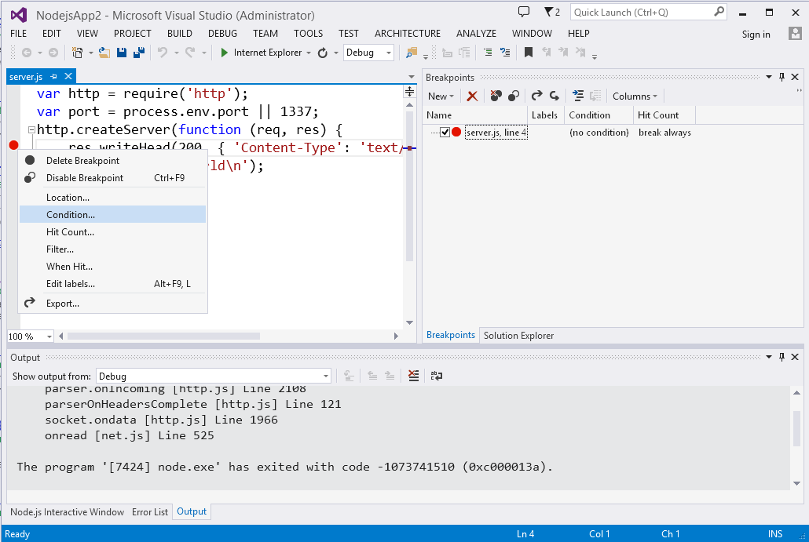
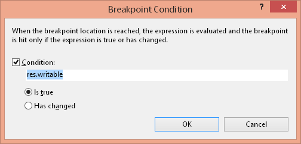
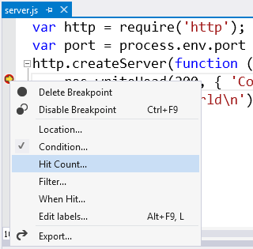
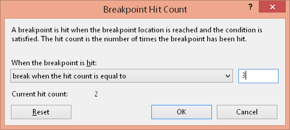
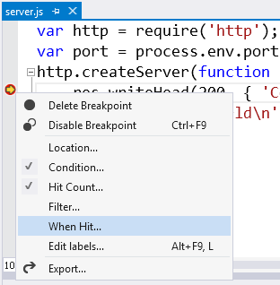
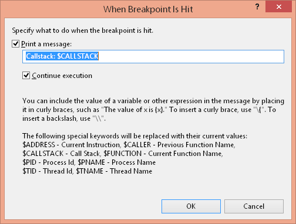
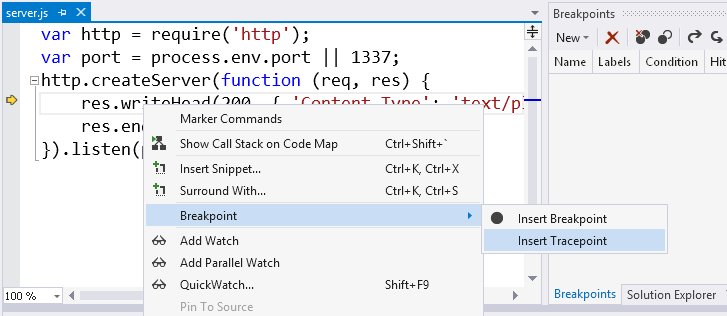
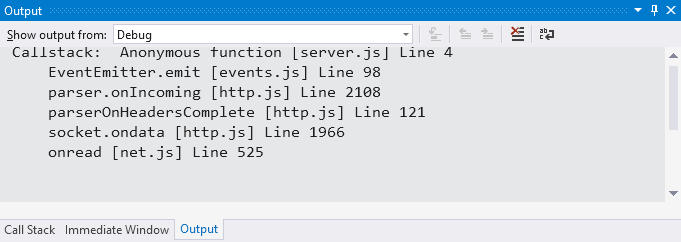
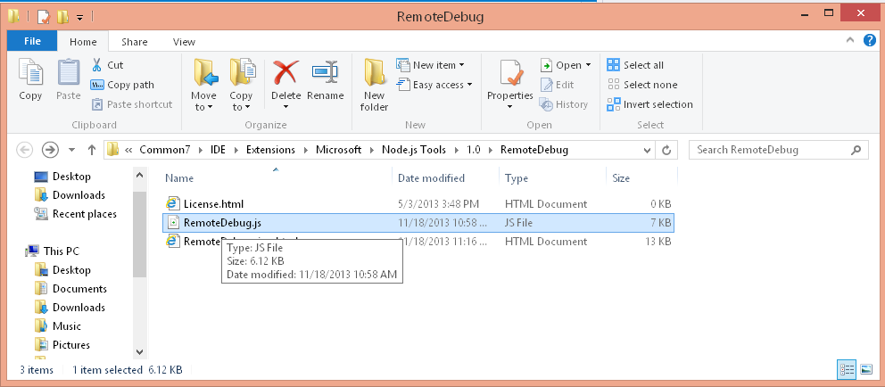

Advanced Debugging
==================

Node.js Tools for Visual Studio (NTVS) include advanced debugging features for debugging Node.js applications, like advanced breakpoints, and remote debugging of Node.js processes running on any OS (Windows, Linux, MacOS).



This section details the NTVS advanced debugging features.  It assumes you already have a basic understanding of debugging with NTVS. (See [wiki:"Debugging" Debugging] for an introduction to debugging with NTVS.)

Advanced breakpoints
--------------------

NTVS supports advanced Visual Studio breakpoints, including conditional breakpoints,  "Hit Count" breakpoints and "When Hit" breakpoints.. Together, these allow you to both attach predicates to your breakpoints and perform logging when they are hit.

### Conditional breakpoints

One may make a breakpoint conditional by right clicking on the breakpoint (in the editor left margin or in the breakpoint window) and choosing 'Condition...'.


This opens the 'Breakpoint Condition' dialog, in which you may configure a breakpoint's condition criteria.  Here you may choose to enable or disable the condition, provide a predicate expression for the condition, and choose whether to break when the condition is true or has changed.  As expected, enabling a condition keeps a breakpoint from breaking when "hit", unless the condition criteria is met.



### "Hit Count" breakpoints

One may make a breakpoint predicated on "hit count" by right clicking on the breakpoint (in the editor left margin or in the breakpoint window) and choosing 'Hit Count...'.



This opens the 'Breakpoint Hit Count' dialog, in which you may configure a breakpoint's hit count criteria.  Here you may choose on which "hit count(s)" to break.  The choices include:

* break always
* break when hit count is equal to
* break when hit count is greater than or equal to
* break when hit count is multiple of 

Choosing the 'break always' option essentially disables hit count processing.  Choosing any of the other options requires providing an integer as additional criteria. As expected, enabling a hit count processing keeps a breakpoint from breaking when "hit", unless the "hit count" criteria is met.



**Note:** One may also inspect and reset the current hit count from the 'Breakpoint Hit Count' dialog

### "When Hit" breakpoints (Tracepoints)

One may configure automated logging of a message when a breakpoint is "hit", by right clicking on the breakpoint (in the editor left margin or in the breakpoint window) and choosing 'When Hit...'.



This opens the 'When Breakpoint is Hit' dialog, in which you may configure a breakpoint's logging behavior.  Here you may enable logging with the 'Print a message:" checkbox.  If enabled, you may provide a message containing text, as well as embedded placeholders for things like function and callstack.  Break state is substituted for used placeholders each time a "When Hit" breakpoint is "hit".  You may also choose whether a "When Hit" breakpoint should automatically 'Continue execution' after logging after being "hit". 



**Note:** One may also directly create a "When Hit" breakpoint (Tracepoint) by right clicking on a line of code in the editor and choosing 'Breakpoint\Insert Tracepoint'.



Logging of "Hit Count" breakpoints (Tracepoints) is sent to the output window.




Remote Debugging (Windows, Linux, MacOS)
----------------------------------------

Node.js Tools for Visual Studio (NTVS) supports attaching to and debugging Node.js processes running behind the remote debugging proxy (RemoteDebug.js). The proxy is necessary to expose the Node.exe debugger port from the target host to the NTVS debugger. Node.exe only exposes its debugger port to the local host where it is running. The remote debug proxy exposes the local port through a remotely accessible port.

Starting NTVS remote debugging requires both preparing the target host, and attaching the NTVS debugger to the remote Node.exe process.

### Target Host Preparation

Preparing a target host for remote debugging is as simple as running your target app behind the remote debug proxy, on the remote host. Where you would normally start a Node.js process directly with:

```
node.exe script.js
```

Instead start the Node.js process with the remote debug proxy, passing it the script to be remotely debugged:

```
node.exe RemoteDebug.js script.js
```

The remote debug proxy (RemoteDebug.js) can be found in the folder opened using the 'Tools\Node.js Tools\Remote Debug Proxy' menu.  It is generally easiest to copy the remote debug proxy to the folder containing the script you would like to debug (as is assumed above).




By default the remote debug proxy proxies a Node.exe debugger to port 5858 on the remote host. This can be configured using the remote debug proxy command line arguments:

```
node.exe RemoteDebug.js -machineport 5860 script.js
```

For configuration details, consult the remote debug proxy help, viewed by running it with the -help command line argument:

```
node.exe RemoteDebug.js -help
```

Note: The remote debug proxy's host debugger port, default (5858) or configured, must be accessible to the machine attaching the NTVS debugger.

### Linux Notes

On a Linux machine, by convention, the Node.js exectable is named nodejs.  For this reason, when preparing a Linux target host for remote debugging, substitute nodejs for node.exe above.  For example:

```
nodejs RemoteDebug.js script.js
```

### Attaching the NTVS debugger

Attaching the NTVS debugger entails walking through the VS "Attach to process" UI. The steps are as follows:

* Launch the "Attach to process" dialog from the 'Debug\Attach to Process' menu


* For 'Transport', choose 'Node remote debugging'


* For 'Qualifier', provide the target host and debugger port (ex. myhost:5858) and hit 'Refresh'


* In 'Available Processes' select the target node.exe process and choose 'Attach'


Unless you immediately hit a breakpoint, the only indication that the debugger has succesfully attached is that it will indicate "Running' in the title bar.  


### Local Attach

It is also possible to attach to a locally running Node.exe process, if it was started with debugging enabled, using the '--debug' command line argument:

```
node.exe --debug server.js
```

To attach to such a locally running Node.exe process, follow the attach instructions above, providing localhost:5858 for 'Qualifier'.

Note: It is possible to run Node.exe with a non-default local debugger port. This is accomplished by providing the desired port with the '--debug' command line argument:

```
node.exe --debug:5860 server.js
```