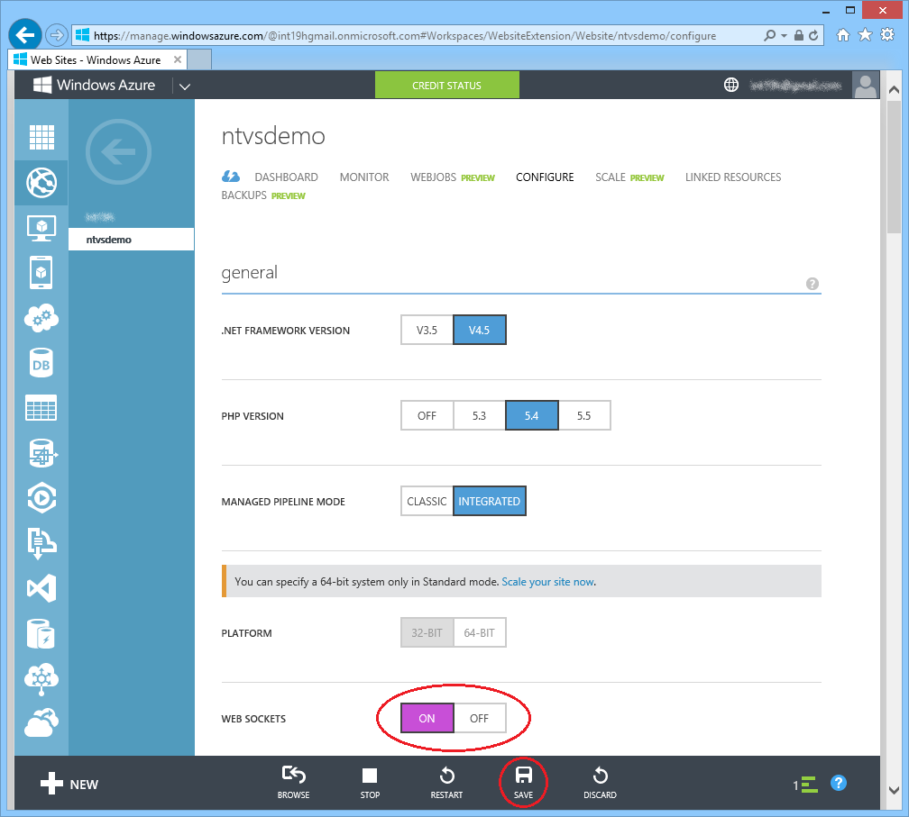
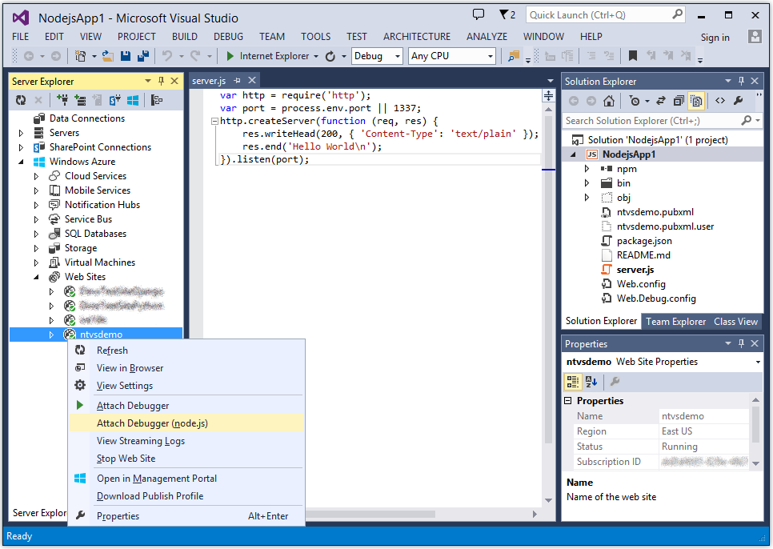
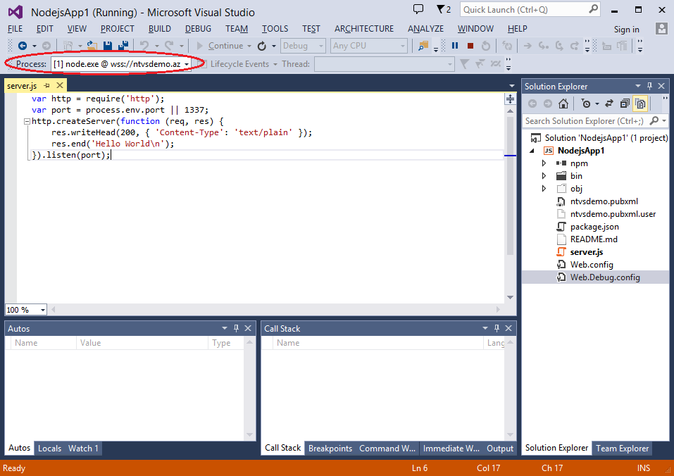
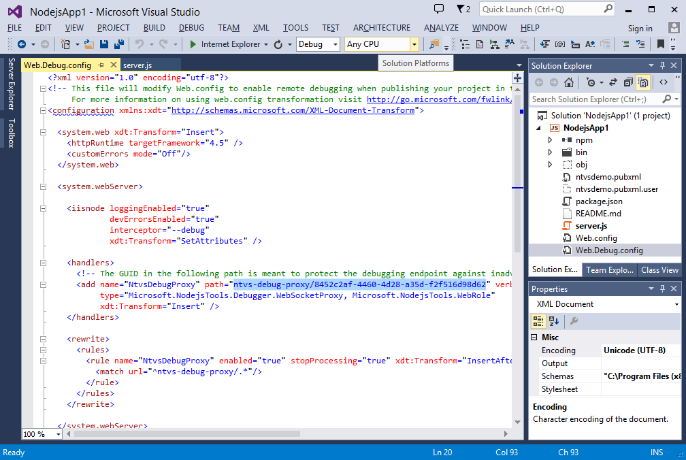
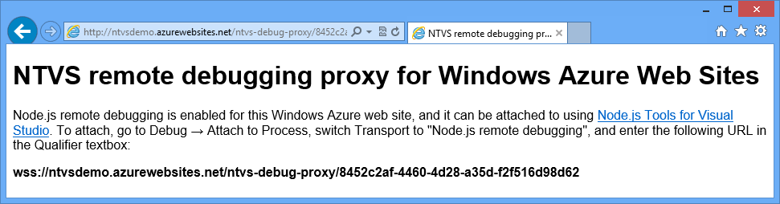
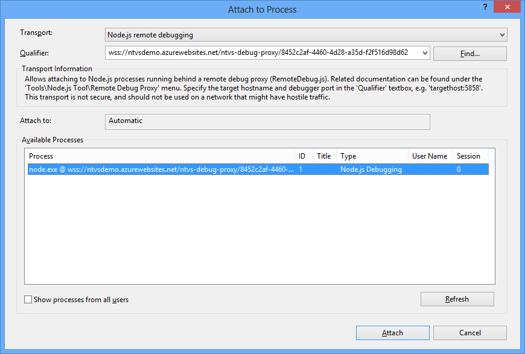

Advanced Debugging
==================

Node.js Tools for Visual Studio (NTVS) include advanced debugging features for debugging Node.js applications, like advanced breakpoints, and remote debugging of Node.js processes running on any OS (Windows, Linux, MacOS), or hosted on Windows Azure.


This section details the NTVS advanced debugging features.  It assumes you already have a basic understanding of debugging with NTVS. (See [wiki:"Debugging" Debugging] for an introduction to debugging with NTVS.)

Advanced breakpoints
--------------------

NTVS supports advanced Visual Studio breakpoints, including conditional breakpoints,  "Hit Count" breakpoints and "When Hit" breakpoints.. Together, these allow you to both attach predicates to your breakpoints and perform logging when they are hit.

### Conditional breakpoints

One may make a breakpoint conditional by right clicking on the breakpoint (in the editor left margin or in the breakpoint window) and choosing 'Condition...'.


This opens the 'Breakpoint Condition' dialog, in which you may configure a breakpoint's condition criteria.  Here you may choose to enable or disable the condition, provide a predicate expression for the condition, and choose whether to break when the condition is true or has changed.  As expected, enabling a condition keeps a breakpoint from breaking when "hit", unless the condition criteria is met.


### "Hit Count" breakpoints

One may make a breakpoint predicated on "hit count" by right clicking on the breakpoint (in the editor left margin or in the breakpoint window) and choosing 'Hit Count...'.


This opens the 'Breakpoint Hit Count' dialog, in which you may configure a breakpoint's hit count criteria.  Here you may choose on which "hit count(s)" to break.  The choices include:

* break always
* break when hit count is equal to
* break when hit count is greater than or equal to
* break when hit count is multiple of 

Choosing the 'break always' option essentially disables hit count processing.  Choosing any of the other options requires providing an integer as additional criteria. As expected, enabling a hit count processing keeps a breakpoint from breaking when "hit", unless the "hit count" criteria is met.


**Note:** One may also inspect and reset the current hit count from the 'Breakpoint Hit Count' dialog

### "When Hit" breakpoints (Tracepoints)

One may configure automated logging of a message when a breakpoint is "hit", by right clicking on the breakpoint (in the editor left margin or in the breakpoint window) and choosing 'When Hit...'.


This opens the 'When Breakpoint is Hit' dialog, in which you may configure a breakpoint's logging behavior.  Here you may enable logging with the 'Print a message:" checkbox.  If enabled, you may provide a message containing text, as well as embedded placeholders for things like function and callstack.  Break state is substituted for used placeholders each time a "When Hit" breakpoint is "hit".  You may also choose whether a "When Hit" breakpoint should automatically 'Continue execution' after logging after being "hit". 


**Note:** One may also directly create a "When Hit" breakpoint (Tracepoint) by right clicking on a line of code in the editor and choosing 'Breakpoint\Insert Tracepoint'.


Logging of "Hit Count" breakpoints (Tracepoints) is sent to the output window.


Remote Debugging (Windows, Linux, MacOS)
----------------------------------------

Node.js Tools for Visual Studio (NTVS) supports attaching to and debugging Node.js processes running behind the remote debugging proxy (RemoteDebug.js). The proxy is necessary to expose the Node.exe debugger port from the target host to the NTVS debugger. Node.exe only exposes its debugger port to the local host where it is running. The remote debug proxy exposes the local port through a remotely accessible port.

Starting NTVS remote debugging requires both preparing the target host, and attaching the NTVS debugger to the remote Node.exe process.

### Target Host Preparation

Preparing a target host for remote debugging is as simple as running your target app behind the remote debug proxy, on the remote host. Where you would normally start a Node.js process directly with:

```
node.exe script.js
```

Instead start the Node.js process with the remote debug proxy, passing it the script to be remotely debugged:

```
node.exe RemoteDebug.js script.js
```

The remote debug proxy (RemoteDebug.js) can be found in the folder opened using the 'Tools\Node.js Tools\Remote Debug Proxy' menu.  It is generally easiest to copy the remote debug proxy to the folder containing the script you would like to debug (as is assumed above).


By default the remote debug proxy proxies a Node.exe debugger to port 5858 on the remote host. This can be configured using the remote debug proxy command line arguments:

```
node.exe RemoteDebug.js -machineport 5860 script.js
```

For configuration details, consult the remote debug proxy help, viewed by running it with the -help command line argument:

```
node.exe RemoteDebug.js -help
```

Note: The remote debug proxy's host debugger port, default (5858) or configured, must be accessible to the machine attaching the NTVS debugger.

### Linux Notes

On a Linux machine, by convention, the Node.js exectable is named nodejs.  For this reason, when preparing a Linux target host for remote debugging, substitute nodejs for node.exe above.  For example:

```
nodejs RemoteDebug.js script.js
```

### Attaching the NTVS debugger

Attaching the NTVS debugger entails walking through the VS "Attach to process" UI. The steps are as follows:

* Launch the "Attach to process" dialog from the 'Debug\Attach to Process' menu


* For 'Transport', choose 'Node remote debugging'


* For 'Qualifier', provide the target host and debugger port (ex. myhost:5858) and hit 'Refresh'


* In 'Available Processes' select the target node.exe process and choose 'Attach'


Unless you immediately hit a breakpoint, the only indication that the debugger has succesfully attached is that it will indicate "Running' in the title bar.  


### Local Attach

It is also possible to attach to a locally running Node.exe process, if it was started with debugging enabled, using the '--debug' command line argument:

```
node.exe --debug server.js
```

To attach to such a locally running Node.exe process, follow the attach instructions above, providing localhost:5858 for 'Qualifier'.

Note: It is possible to run Node.exe with a non-default local debugger port. This is accomplished by providing the desired port with the '--debug' command line argument:

```
node.exe --debug:5860 server.js
```


Remote Debugging on Windows Azure
---------------------------------

NTVS has special support for remote debugging of code running on Windows Azure Web Sites. Unlike simple remote debugging, the target machine is not directly accessible over TCP in this scenario, but NTVS comes with a WebSocket proxy for the debugging protocol that exposes the debugger protocol via HTTP. When you create a new Windows Azure project, the proxy is fully configured for you in Web.Debug.config, and will be enabled on the web site if you publish your project in the "Debug" configuration by following [wiki:"these steps" AzureDeployment#publish-to-azure-web-site-using-web-deploy].

Since the Azure remote debugging uses web sockets, it must be enabled for your web site in the management portal. This setting can be found on the web site management page, on the "Configure" tab - don't forget to click "Save" after changing it:



Once your project is properly deployed and web sockets are enabled, you can attach to the web site from Server Explorer. If you do not have the Server Explorer window open, you can open it via <span class="menu">View</span> → <span class="menu">Server Explorer</span>. Then, locate your web site under Windows Azure → Web Sites, and right-click on it. If it is running, and your project has been deployed to it using the Debug configuration, you should see the "Attach Debugger (node.js)" command in the context menu:



Note that on Visual Studio Professional and above, you will see two "Attach Debugger" commands - the default one with no qualifiers is used to debug .NET applications running under IIS, and is only useful if you co-host .NET code alongside your node.js app. To attach to your node.js app, you need to use the "Attach Debugger (node.js)" command. If you do not see that command in the context menu for your site (i.e. you only see "Attach Debugger", or you see neither), then one of the following applies:

* You do not have Visual Studio 2013:
 * Server Explorer functionality is not available on your version of Visual Studio. You will have to use attach via Attach to Process dialog as described [below](#attaching-without-server-explorer).
* You do not have Visual Studio 2013 Update 2 RC or later installed:
 * Download and install [Update 2](http://www.microsoft.com/en-us/download/details.aspx?id=42023). 
* The project is not opened in Solution Explorer:
 * Open the project that you're trying to debug via File → Open → Project/Solution.
* The web site is not running (i.e. stopped - this can be seen from its icon):
 * Start the web site by right-clicking on it in Server Explorer and selecting "Start Web Site" in the context menu.
* The project was not deployed in the "Debug" configuration:
 * Re-deploy the project in "Debug" configuration as described [wiki:"here" AzureDeployment#publish-to-azure-web-site-using-web-deploy].
* Web.Debug.config was deleted from the project, or modified to disable the debug proxy.
 * Restore the original Web.debug.config. The easiest way to do so is to create a new Blank Windows Azure Node.js Application project, and then copy Web.debug.config from it to your existing project.

If the attach has completed successfully, Visual Studio should switch to debug window profile, and the title bar should say "(Running)" after the opened project name. You should also be seeing the debugger toolbar, which indicates the process being debugged - for a Windows Azure web site, it should include a corresponding wss:// URI:



Once attached, the debugging experience is the same as for regular remote debugging. 


## Attaching without Server Explorer

It is also possible to attach to a Windows Azure web site directly from the Attach to Process dialog, similar to regular remote debugging. To do so, you will first need to find out the debugger endpoint URL for your web site - it is defined in Web.Debug.config in your project, and is different for every project (it is automatically generated when the project is created). Look for an HTTP handler named "NtvsDebugProxy", and note its path:



That path is relative to your web site root. For example, given a web site at **http://ntvsdemo.azurewebsites.net**, and the path as specified on the screenshot above, the proxy is at http://ntvsdemo.azurewebsites.net/**ntvs-debug-proxy/8452c2af-4460-4d28-a35d-f2f516d98d62**. You can open that URL in the browser to verify that the debugging proxy is up and running, which will also provide further instructions on attaching:



Note the URL provided at the bottom. It is, in fact, identical to the URL that you used to open the page, except that scheme is **wss://** rather than **http://**. 

Now, to attach to the debugger using that URL, open Debug → Attach to Process, select "Node.js remote debugging" in Transport dropdown, enter the **wss://** URL into the Qualifier textbox, and press Enter. If NTVS can successfully connect to the web site, it will show a single node.exe process in the process list below the qualifier. Press Enter or click "Attach" to attach to that process.


