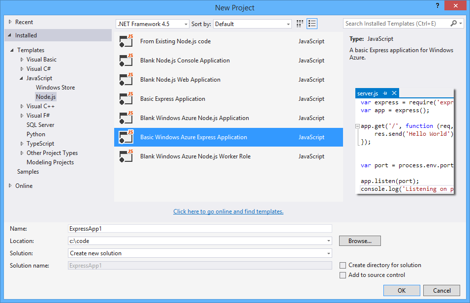
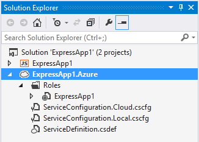
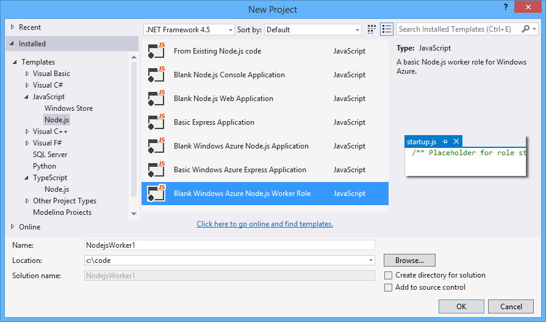
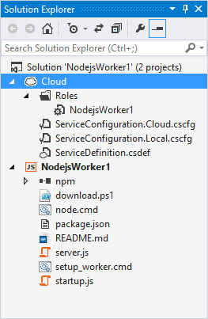
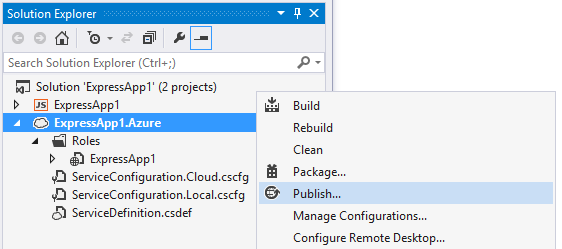
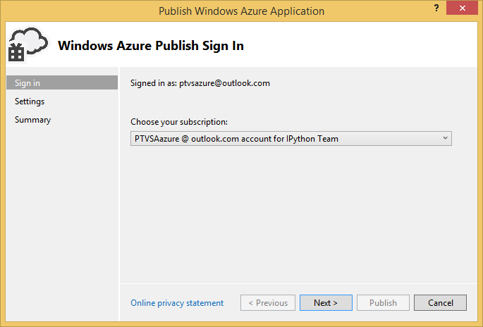
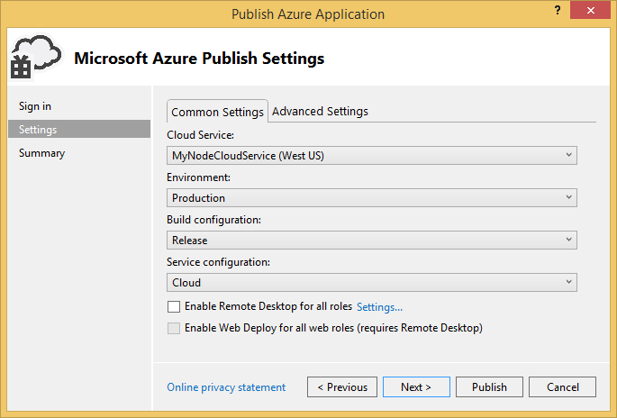
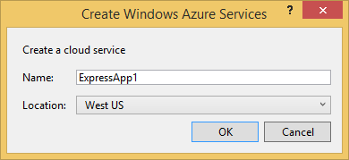
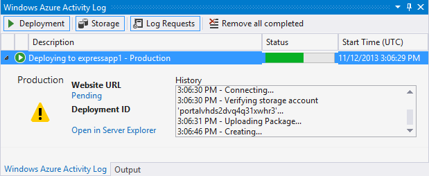
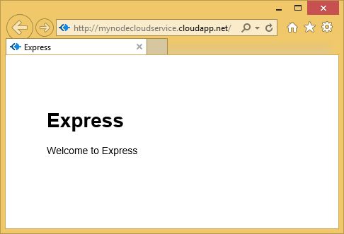

Publish to Cloud Service
========================

This section describes how to use the **Publish** command to deploy your Node.js application to an Azure Cloud Service.

**Requirements**: Cloud Service support requires the following components which can be installed using Web Platform Installer by clicking on these links:

- [Windows Azure SDK for .NET for VS 2013](http://go.microsoft.com/fwlink/p/?linkid=323510&clcid=0x409) 
- [Windows Azure SDK for .NET for VS 2012](http://go.microsoft.com/fwlink/p/?linkid=323511&clcid=0x409) 
- [Windows Azure SDK for Node.js](http://go.microsoft.com/fwlink/?linkid=254279&clcid=0x409)

**Notes**:

- The **Windows Azure SDK for Node.js** is currently **not compatible** with the 64-bit version Node.js. 
- The **Windows Azure SDK for Node.js** is required for running in the Windows Azure emulator / IIS Node, but optional for Publish to Azure.
- The **Windows Azure SDK for .NET** provides the Visual Studio integration for Cloud Services.  The command to convert to a Cloud Service Project won't be available if you don't have the SDK installed.

Creating a Web Role
-------------------

To create a Web Role, use a project template designed for Azure, such as **Blank Windows Azure Node.js Application**, or **Basic Windows Azure Express Application**

Note: You can also use the TypeScript version of these project templates.

The Windows Azure project templates have additional functionality for deploying to Windows Azure. There is a web.config file which configures Node.js for running under IIS Node as well as deployment scripts for starting a Node.js application on a Windows Azure web role.

Then, add a cloud service project to your solution. Right-click on on the project in Solution Explorer and select **Convert to Windows Azure Cloud Service Project** menu item.

This will add a new project to your solution.

Creating a Worker Role
----------------------

To create a Worker Role, use the project template **Blank Windows Azure Node.js Worker Role**.

Note: You can also use the TypeScript version of this project template.

This will create a solution with a Node.js project and a Cloud Service project.

Publish the Cloud Service to Azure
----------------------------------

Right-click on the Cloud Service project node in Solution Explorer, and choose **Publish...**.

**Note**: The Node.js project also has a Publish command, but that is for deploying to an Azure Web Site.

First you'll need to select your Windows Azure subscription.  You can do so by downloading credentials, or by signing in to your account.

Next you'll need to select a cloud service (virtual machine) to host your web role/worker role.  You can configure several different options including enabling remote desktop to connect to the virtual machine.

If you don't have an existing Cloud Service, you can create one by selecting **Create New...** from the drop down.

Finally, click **Publish**.  The files from your project will be collected and the publish will begin. You can monitor the progress in the Windows Azure Activity Log.

When it's done, click on the **Website URL** link in the Windows Azure Activity Log to open the site in your web browser.

Known issues
------------

- If your site contains a deep nested hierarchy of node_modules folders publishing can fail if a path exceeds 260 characters.  This is a limitation of Windows file APIs.  If you encounter this you'll need to move your project to a directory with a shorter path.

- A Node.js application published to a **Windows Azure Cloud Service** may not work properly due to a timing issue when the Windows Azure Cloud Service project is created.  If this happens, you'll get a **500 Internal Server error** when browsing to the Cloud Service url.  To avoid this problem, **save, close and reopen the solution after creating the Cloud Service project** (Convert to Windows Azure Cloud Service Project command).
