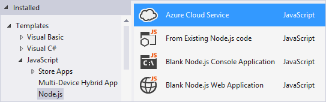
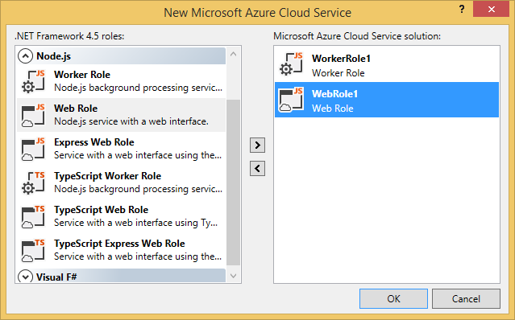

Microsoft Azure Cloud Service Projects
======================================

Microsoft Azure Cloud Services can be written in Node.js, and Node.js Tools for Visual Studio includes templates to help you get started.

Requirements
------------

Cloud Service support requires the following components which can be installed using Web Platform Installer:

- [Azure Tools for VS 2013](http://go.microsoft.com/fwlink/p/?linkid=323510)
- [Azure Tools for VS 2012](http://go.microsoft.com/fwlink/p/?linkid=323511)
- [Azure SDK for Node.js](http://go.microsoft.com/fwlink/?linkid=254279)

**Notes**:

- The **Azure Tools for VS** (aka Azure SDK for .NET) provides the Visual Studio integration for Cloud Services.
- The **Azure SDK for Node.js** is currently **not compatible** with the 64-bit version Node.js. 
- The **Azure SDK for Node.js** is required for running in the Microsoft Azure emulator / IIS Node, but optional for deployment to Azure.

What is a Cloud Service?
------------------------

Cloud Service is a model of an application that consists of multiple *roles*.
Each role performs a conceptually separate task, but may be replicated in order to provide scaling.
A cloud project may have any number of roles, and deploying the project will instantiate as many virtual machines as required.

Visit the [Cloud Service documentation](http://go.microsoft.com/fwlink/?LinkId=306052) for more details.

Roles
-----

Microsoft Azure Cloud Service supports two different kinds of roles: *web* and *worker*.

Web roles are intended for hosting front-end web applications.

Worker roles are intended for long-running processes that do not interact directly with users.

In practice, both can be used to host a Node.js web site. The difference is that web roles run through IIS, and worker roles don't.

Create
======

To start creating your project, select the Azure Cloud Service template from the New Project dialog.
If you have not installed the Azure Tools for Visual Studio, you will be prompted to install them now.

In the next dialog that appears, you may select one or more roles to include.

Cloud projects may combine roles written in different languages, so you can easily write each part of your application in the most suitable language.
To add new roles to the project after completing this dialog, you can right click 'Roles' in Solution Explorer and select one of the items under 'Add'.

Deploy
======

Right-click on the Cloud Service project node in Solution Explorer, and choose **Publish...**.

**Note**: The Node.js project also has a Publish command, but that is for deploying to an Azure Web Site.

First you'll need to select your Azure subscription.  You can do so by downloading credentials, or by signing in to your account.

Next you'll need to select a cloud service to host your web role/worker role(s).  You can configure several different options including enabling remote desktop to connect to the virtual machine.

If you don't have an existing Cloud Service, you can create one by selecting **Create New...** from the drop down.

Finally, click **Publish**.  The files from your project will be collected and the publish will begin. You can monitor the progress in the Microsoft Azure Activity Log.

When it's done, click on the **Website URL** link in the Microsoft Azure Activity Log to open the site in your web browser.

Known issues
------------

- If your site contains a deep nested hierarchy of node_modules folders publishing can fail if a path exceeds 260 characters.  This is a limitation of Windows file APIs.  If you encounter this you'll need to move your project to a directory with a shorter path.
