Azure Deployment
================
You can deploy your Node.js application to Windows Azure directly from Visual Studio.  You can deploy to an Azure Web Site or Cloud Service (Web Role).

**Note**: Worker Role is currently not supported.

Publish to Azure Web Site using Web Deploy
------------------------------------------
This section describes how to use the **Publish** 
command to deploy your Node.js project to a Windows Azure Web Site.

To use this functionality, make sure to create a Windows Azure project. Windows Azure project templates have additional functionality for deploying to Windows Azure. There is a web.config file which configures Node.js for running under IIS Node.

Deployment will include all the files in your project, as well as the node_module folder, even if it's not part of the project.

Right-click on the project node in Solution Explorer, and select **Publish...**.

This will bring up the publish profile which will allow you to import your Windows Azure publish settings file for the web site.

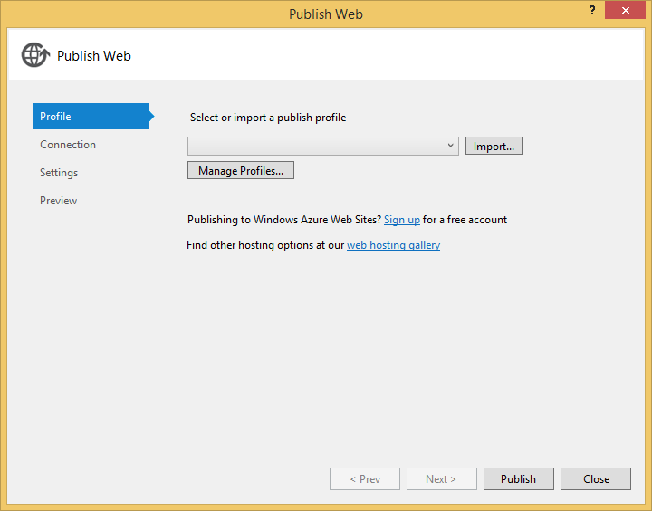

You can also sign-in to your Windows Azure account and create a new Web Site directly from the publish dialog.

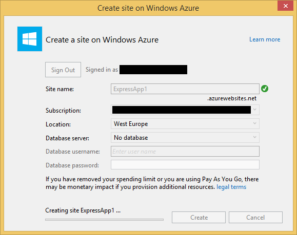

Once you have the publish settings you're ready to deploy. You can click Preview to see the files that will be uploaded.

Click **Publish** and the application will be deployed. Progress will be shown in the output window.

When it's done, a new browser window will open to the site.

Publish to Azure Web Site using Git
-----------------------------------
Visual Studio 2013 has integrated Git support, so it's easy to deploy to Azure using Git, no command-line necessary.

**Note**: Git integration is also available for Visual Studio 2012 as an [extension](http://visualstudiogallery.msdn.microsoft.com/abafc7d6-dcaa-40f4-8a5e-d6724bdb980c) on the Visual Studio gallery.

From the [Windows Azure portal](http://manage.windowsazure.com), create a new Web Site.

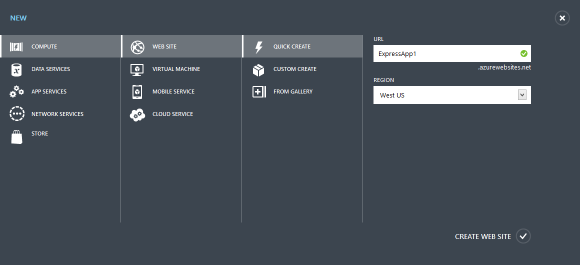

Click on the newly created Web Site, and choose **Set up deployment from source control**.

Then select **Local Git Repository**.

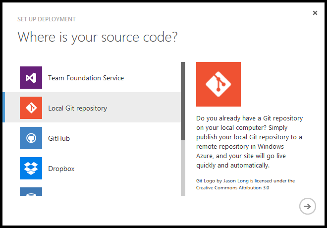

The **URL** to the repository can be copy/pasted from the portal.

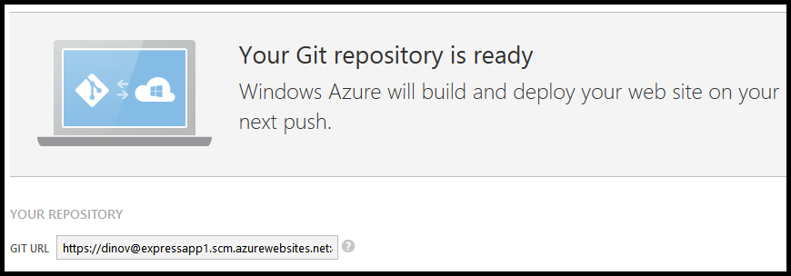

In Visual Studio, create a new Node.js project or load an existing project which isn't associated with source control.

**Note**: Git deployment to Azure does not require the use of the Windows Azure project types.  You may want to use them anyway, as you get a default web.config which you can configure. If you Git deploy a project without a web.config, Windows Azure will detect that it's a Node.js application and use an appropriate web.config for it.

Select **File**->**Add to Source Control**.

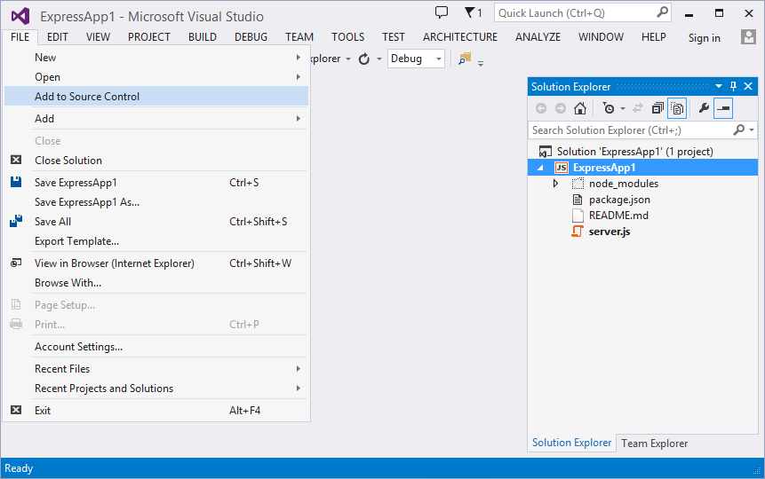

Then select Git as the source control system.

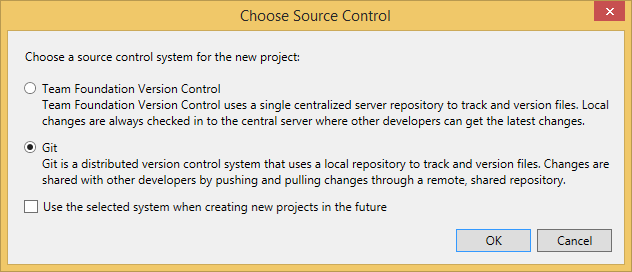

A Git repository will be created for your solution.  It will be listed in the **Team Explorer** window, under **Local Git Repositories**.

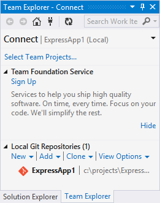

From **Team Explorer**, click on the **Home** button on the toolbar. You may see a prompt to install Git command prompt tools. You may choose to install them, but they are not necessary.

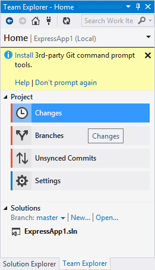

Click on **Changes** to see your pending changes. Review the files that will be included in the commit, enter a comment and click **Commit**.

**Note**: When using Git deployment, the node_modules are not checked in to the repository.  When Azure detects a new deployment, it will automatically npm install the modules specified in package.json.

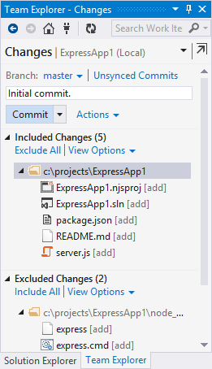

Once it's done, you'll see a notification for your commit.

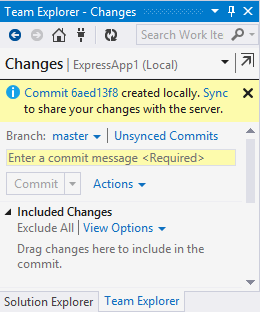

In the notification message, click **Sync** to bring up the **Unsynced Commits** page.

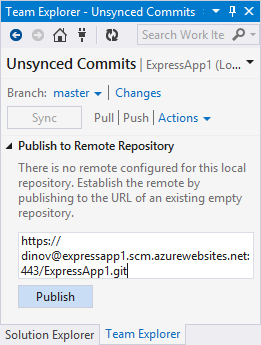

Enter the URL for the Git repository, as displayed in the Azure Portal.  Click **Publish**.  Enter your credentials when prompted.

The **Deployments** page for your Web Site will show the commit information.

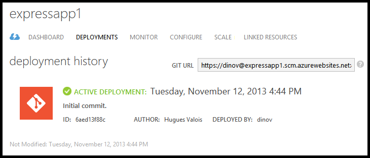

You can click the **Browse** button at the bottom of the **Deployments** page to navigate to your site.

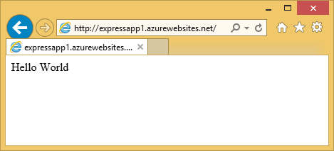

Publish to Cloud Service
---------------------------
This section describes how to use the **Publish** 
command to deploy your Node.js project to a Windows Azure Cloud Service (Web Role).

To use this functionality, make sure to create a Windows Azure project. Windows Azure project templates have additional functionality for deploying to Windows Azure. There is a web.config file which configures Node.js for running under IIS Node as well as deployment scripts for starting a Node.js application on a Windows Azure web role.

You first need to add a cloud service project to your solution. Right-click on on the project in Solution Explorer and select **Convert to Windows Azure Cloud Service Project** menu item.

**Important**: Cloud Service support requires the **Windows Azure .NET SDK**, which you can install using the **Web Platform Installer**.  You will not see the command to convert to a Cloud Service Project if you don't have the SDK installed. The documentation here is based on version 2.2 of the SDK.

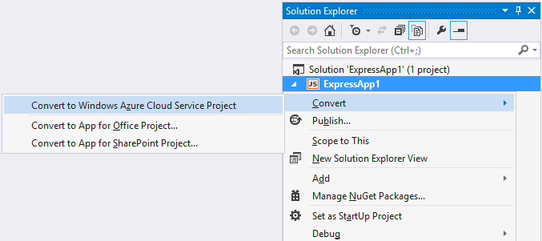

This will add a new project to your solution.

Right-click on the new project's node in Solution Explorer, and choose **Publish...**.

**Note**: The Node.js project also has a Publish command, but that is for Web Deploy to an Azure Web Site.

First you'll need to select your Windows Azure subscription.  You can do so by downloading credentials, or sign-in to your account.

Next you'll need to select a cloud service (virtual machine) to host your web role.  You can configure several different options including enabling remote desktop to connect to the virtual machine.

If you don't have an existing Cloud Service, you can create one by selecting **Create New...** from the drop down.

Finally, click **Publish**.  The files from your project will be collected and the publish will begin. You can monitor the progress in the Windows Azure Activity Log.

When it's done, click on the **Website URL** link in the Windows Azure Activity Log to open the site in your web browser.

Known issues
------------
- If your site contains a deep nested hierarchy of node_modules folders publishing can fail if a path exceeds 260 characters.  This is a limitation of Windows file APIs.  If you encounter this you'll need to move your project to a directory with a shorter path.
