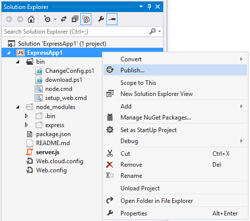
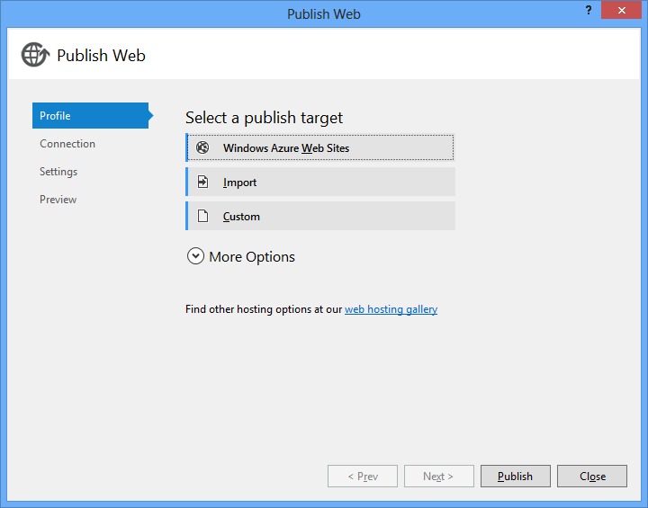
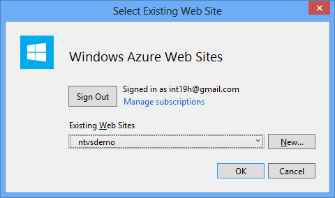
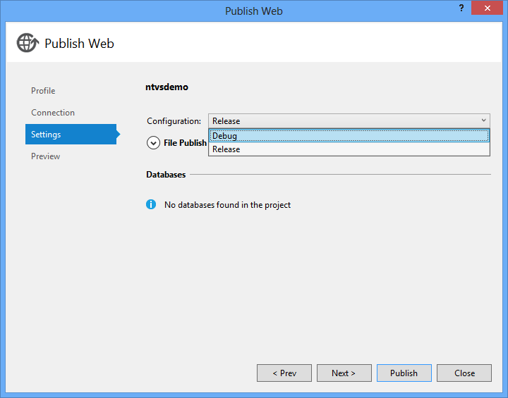
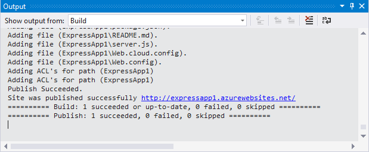
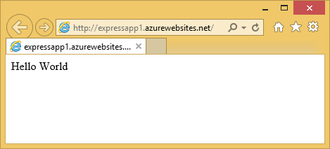

Publish to Microsoft Azure Website using Web Deploy
====================================================

This section describes how to use the **Publish** command to deploy your Node.js project to an Azure Website.

To use this functionality, make sure to create an Azure project. Azure project templates have additional functionality for deploying to Azure. There is a web.config file which configures Node.js for running under IIS Node.

Deployment will include all the files in your project.  Files in the node_modules folder are included automatically, even if they are not part of the project.

Right-click on the project node in Solution Explorer, and select **Publish...**.



This will bring up the publish profile which will allow you to specify the Website to which the project will be published.



The easiest way to do so is to select the Website from the picker by choosing the first option on the dialog above, and logging in using your Azure credentials. This will open a new dialog that will provide a list of all sites associated with your Azure subscription, as well as the ability to create a new site.



Alternatively, if you have a downloaded publish profile for your Website, you can use "Import" to use the corresponding publish settings without logging in.

If you plan on debugging your published project directly on Azure servers by using Node.js remote debugging, you need to publish the site in "Debug" configuration. This setting is separate from the current active solution configuration, and always defaults to "Release". To change it, open the "Settings" tab, and use the "Configuration" combo box:



Note that publishing in "Debug" configuration will enable the debugging server on your Website, as well as a number of advanced logging options - you can see the detailed changes in Web.Debug.config file that is a part of your project. This configuration negatively affects the performance of your site and increases its attack surface, and so it should only be used for testing, and never for production websites. See [wiki:"Advanced Debugging" AdvancedDebugging] for more information on debugging your Node.js application Azure Website.

If you are publishing an app to an existing Website, where a different application was published in the past, you'll want to check the **Remove additional files at destination** under **File Publish Options** so that there are no leftover files from the previous project.

Once you have the publish settings you're ready to deploy. You can click Preview to see the files that will be uploaded.


You'll notice that all files under your project folder, including the node_modules folder, will be deployed.

Click **Publish** and the application will be deployed. Progress will be shown in the output window.



If you didn't start with an Azure project type, you'll get an error like the one below. To convert a non-Azure project type into an Azure project type, see the next section.

```
Error : web.config not found in project, to create a project to deploy to Microsoft Azure you must create an Azure Node.js project.
```

When it's done, a new browser window will open to the site.




Converting to an Azure project type
-----------------------------------

You can manually modify your existing non-Azure project to make it possible to deploy to Azure.

The difference between the Azure and non-Azure project types is that Azure projects contain the following additional files:

- /web.config
- /bin/ChangeConfig.ps1
- /bin/download.ps1
- /bin/node.cmd
- /bin/setup_web.cmd

The easiest way to get them is to create a new temporary Azure project type, such as:

- Blank Azure Node.js Web Application
- Basic Azure Node.js Express Application
- Starter Azure Node.js Express Application
- Basic Azure Node.js Express 4 Application

And copy the missing web.config and bin folder from the new project to your existing project.

Note that in web.config, the starter .js file (app.js, server.js or something else) appears a few times. Make sure that it matches your starter file, otherwise your application won't run properly when it's deployed on Azure.


File watching
-------------

There's a file watcher running on the Azure Website that detects changes to files and restarts automatically. The settings for the file watcher are set in the web.config file:

```
<iisnode watchedFiles="web.config;*.js"/>
```

You can add more file types, such as `.jade` to the semicolon separated list.

If the site doesn't restart automatically after you've published, you'll need to click on **RESTART** in the portal page for your site. Note that it takes a few seconds after it reports that it's done until the site is running again with your updates.


Known issues
------------

- If your site contains a deep nested hierarchy of node_modules folders publishing can fail if a path exceeds 260 characters.  This is a limitation of Windows file APIs.  If you encounter this you'll need to move your project to a directory with a shorter path.
