Debugging
=========
Node.js Tools for Visual Studio includes comprehensive support for debugging Node.js applications. This includes standard support for Stepping, Breakpoints, "Break on exception", and inspection of application running state using the Locals, Watch, Immediate and Callstack tool windows.

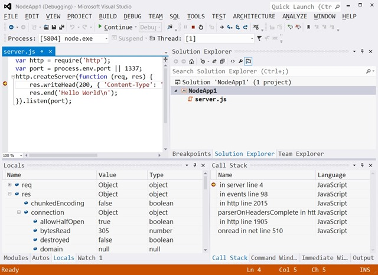

Launching the Node.js Debugger
------------------------------
Debugging a Node.js project is as straightforward as opening (or creating) the project in Visual Studio, setting desired breakpoints, and choosing '**Debug\Start Debugging**' (F5). By default this will launch Node.exe under the debugger for your project's startup file, and launch a browser to your Node.js application's URL.

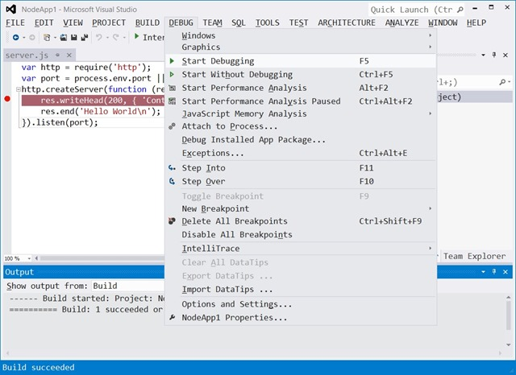

**Note**: It is also possible to start debugging a Node.js project by choosing Step Into (F11) or Step Over (F10). This will launch the debugger and the browser, and break at your project's startup file's entry point.

Stepping
--------
Once debugging, you may step through running code using the Step Over (F10), Step Into (F11) and Step Out (shift-F11) commands.

Breakpoints
-----------
Before or during debugging, you may set and modify breakpoints by using either the Toggle Breakpoint (F9) command, the breakpoint margin at the left of a code editor, or the breakpoint window. Node.js Tools for Visual Studio supports standard, conditional, "Hit Count" and "When Hit" breakpoints.

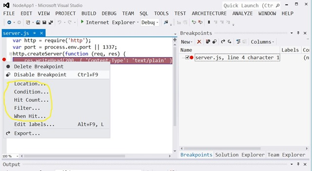

To run until you hit a breakpoint (or exception) you may use the Continue command (F5).

Break on Exception
------------------
By default, the Node.js debugger breaks on exception. If an exception is hit while running under the debugger, the debugger will break and then pop-up a dialog containing the exception details.

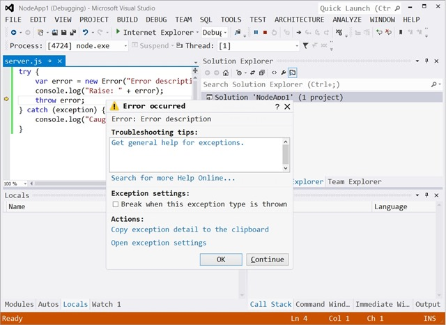

When broken after an exception is hit, the debugger supports the same running state inspection as when broken after stepping, or at a breakpoint (discussed below).

By default, the Node.js debugger breaks on all exceptions, however, the set of exceptions to break on may be modified using the Exceptions window.

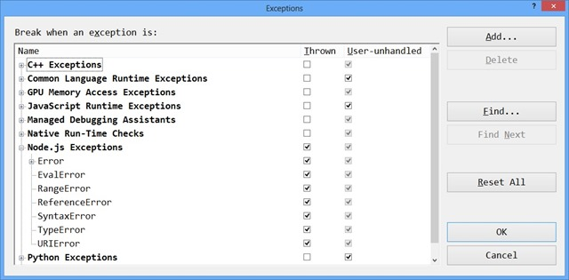

You may bring up the Exceptions window from the "Debug\Exceptions..." menu command.

Running state inspection
------------------------
When broken under the debugger, you may use the Locals, Watch, Immediate and Callstack windows to inspect the running state of a debugged app.

The **Locals** window provides a view of the current stack frame's parameters and local variables. It also allows expanding objects and arrays to see their members by clicking the '+' expansion indicator

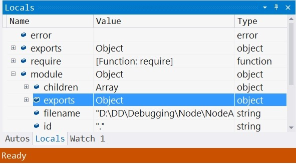

The **Watch** window provides a view of user defined expressions. Other than only including user added items, it behaves much like the Locals window.

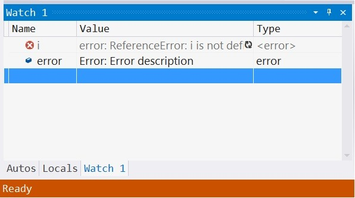

The **Immediate** window behaves much like a debug REPL in that entered expressions are evaluated against the current stack frame and results are printed.

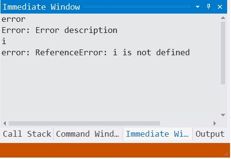

The **Callstack** window provides a view of the callstack for the "instruction pointer" at which the debugger is broken. You may select the stack frame used as context in the other state inspection windows (Locals, Watch and Immediate) by double clicking on a desired stack frame's name.

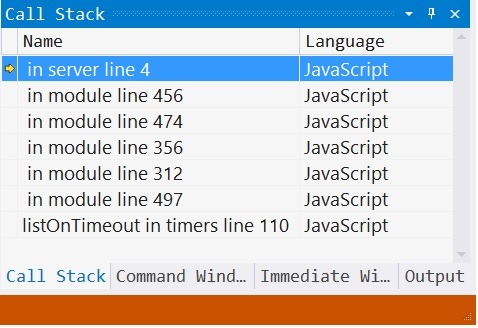

### Hover tips
It is worth noting that hovering over a valid identifier or selected expression in a Node.js code editor while broken in the Node.js Debugger will provide a popup with results from evaluating the identifier or expression. Like the Locals and Watch window, the evaluation results may be expanded to drill into object and array members.

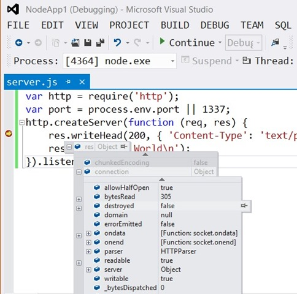

Debugging options
-----------------
Non-default debugging options may be set from a project's 'General' property page. To access the debugging options, right click on the project and choose '**Properties**', then select the '**General**' tab.

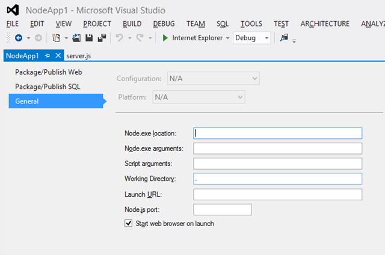

Here you can override the defaults for the following:

- Node.exe to run
- Command line arguments passed to Node.exe
- Arguments passed to the debugged/run script
- Working directory
- Whether to launch a web browser when launching the debugger
- URL to which to navigate a launched web browser
- Node.js port to use -- Note that this defaults to a generated, available port number

Debugger Attach
---------------
It is possible to attach the Node.js debugger to a running Node.exe process as long as that process was started with the `--debug` command line argument. To attach to such a running process, choose '**DEBUG\Attach to Process...**' to bring up the 'Attach to Process' dialog.

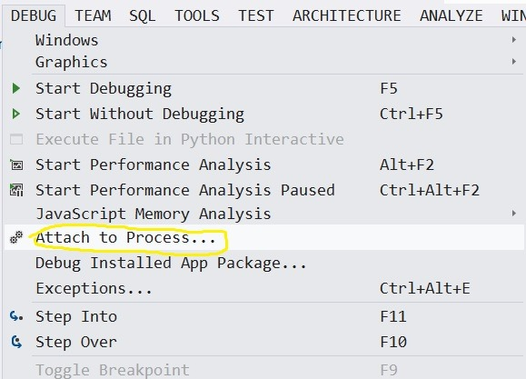

Here you may choose '**Node remote debugging (unsecured)**' for Transport, provide a Qualifier like 'localhost:5858', choose 'Refresh' and 'Attach' to an available process.

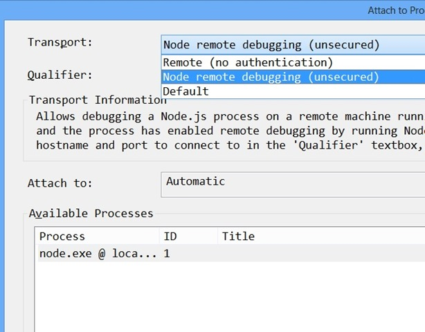

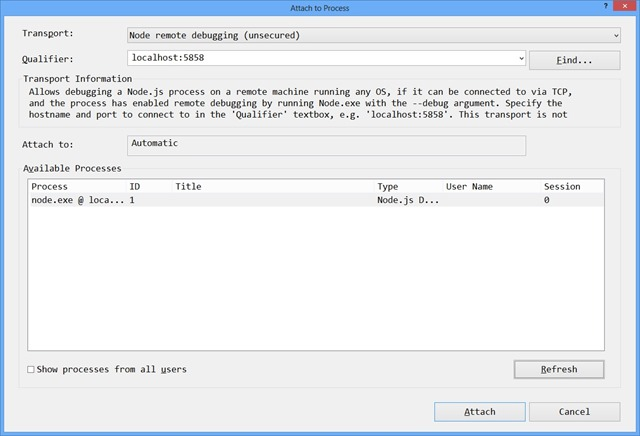

5858 is the default port number opened by Node.exe to support attaching a debugger. You may specify a non-default port number using the `--debug=<port#>` Node.exe command line argument.

Remote Debugging
----------------
When Node.exe is run with the `--debug` command line argument, It opens the default or given debugging port on localhost. This means that without some kind of a proxy, you can only attach to local Node.exe processes. If you need to perform remote debugging, you can use the Remote Debugging Proxy, installed with Node.js Tools for Visual Studio (RemoteDebug.js). This can be found using the '**TOOLS\Node.js Tools\Remote Debugging Proxy\Open Containing Folder**' menu command. To remote debug, instead of running your debuggee script using:

`Node.exe --debug <script>`

use:

`Node.exe RemoteDebug.js <script>`

This will effectively open up a debug port (5858 by default) on the debuggee machine, allowing debug attach from another machine running the Node.js debugger. Note that running `Node.exe RemoteDebug.js --help` will provide help on the Remote Debugging Proxy command line, which allows non-default port numbers, etc.

Alpha Limitations
-----------------
The Alpha release of the Node.js debugger has the following limitations:

- There are known issues with advanced breakpoints (conditional and  hit count breakpoints), particularly around the binding of breakpoints within callbacks.  For the time being, please limit your breakpoint usage to standard breakpoints. 
- Closed over variables don't show up in the locals window when broken within a closure.  As a workaround, you may hover over closed over variables in the editor, or add them to the watch window. 
- Stepping over "require" of modules with many thrown exceptions (ex. express) is slow when exception debugging is enabled.  As a workaround, you may disable Node.js exception debugging from the Debug\Exceptions dialog.

