Debugging
=========
Node.js Tools for Visual Studio (NTVS) includes comprehensive support for debugging Node.js applications. This includes standard support for Breakpoints, Stepping, "Break on exception", and inspection of application running state using the Locals, Watch, Immediate and Callstack tool windows.

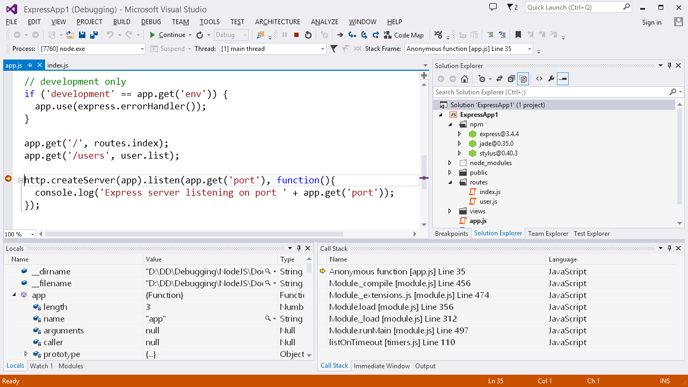

This section provides a brief overview of debugging in Visual Studio, and details the  debugging extensions provided by NTVS.

Note that there is a NTVS Debugger overview video which covers much of the same material: [https://www.youtube.com/watch?v=-ir9ZB8lUg4](https://www.youtube.com/watch?v=-ir9ZB8lUg4)

Basic Debugging
---------------

To use debugging support in NTVS, you will need to be using a project. (See [wiki:"Projects" Projects] for information on creating and using projects.) With a project, you can associate debugging settings with your script, including a startup file and command-line arguments. These options will prevent you from needing to start your programs from the command line. See [Debugging options](#debugging-options) for information about modifying these settings.

When debugging Node.js applications with NTVS, principles common to all languages in Visual Studio apply.

### Launching the Node.js Debugger

Debugging a Node.js project is as straightforward as opening (or creating) the project in Visual Studio, setting desired breakpoints, and choosing '**Debug\Start Debugging**' (**F5**). By default this will launch Node.exe under the debugger for your project's startup file, and launch a browser to your Node.js application's URL.

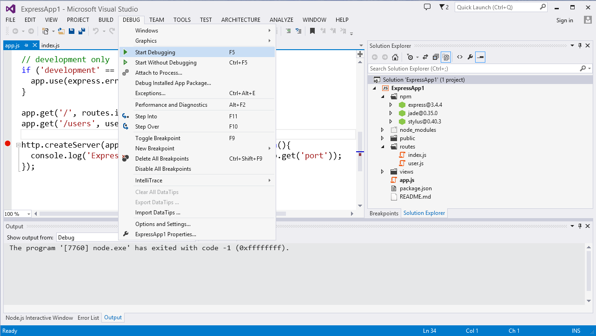

**Note**: It is also possible to start debugging a Node.js project by choosing Step Into (F11) or Step Over (F10). This will launch the debugger and the browser, and break at your project's startup file's entry point.

--(

>>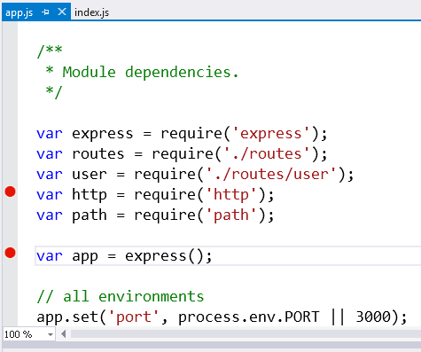

### Breakpoints

Breakpoints, as shown in the image to the right, are lines of code where the debugger should stop executing and allow you to investigate the program state. They can be set by clicking in the margin of the code editor, or by right-clicking on a line of code and selecting Breakpoint, Insert Breakpoint.

--)

Node.js Tools for Visual Studio supports standard and advanced (conditional, "Hit Count" and "When Hit") breakpoints.  (See [wiki:"Advanced Debugging" Features Advanced Debugging] for information on creating and using advanced breakpoints.)

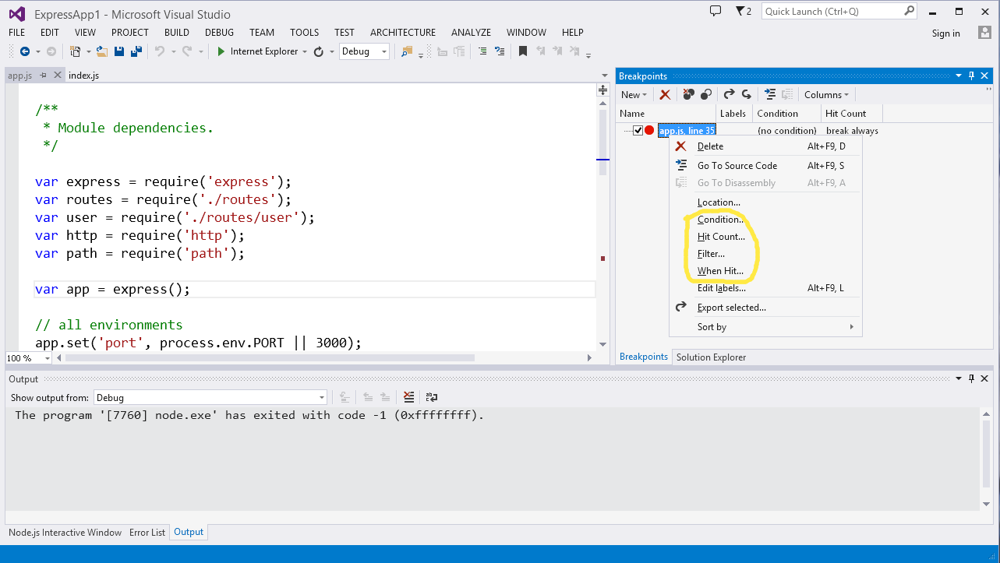

### Stepping

--(

>>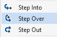

Once you've broken into the debugger, you can step through your code one statement at a time. The step commands include Step Into, Step Over, and Step Out.

Step Into will execute the next statement and stop. If the next statement is a call to a function, the debugger will stop at the first line of the function being called. Check the Debug, Step Into menu to find the keyboard shortcut to use to step (typically F11).

Step Over will execute the next statement, but if it is a call to a function then the entire function will be executed. This allows you to easily skip functions when you are not interested in debugging them. Check the Debug, Step Over menu to find the keyboard shortcut (typically F10).

Step Out will execute until the end of the current function. It is useful when there is nothing else interesting in the current function. Check the Debug, Step Out menu to find the keyboard shortcut (typically Shift+F11).

--)

If you want to continue running, you may use the Continue command (typically F5). Your program will not break until the next breakpoint. Note that when you Step Over or Step Out, if the running code hits a breakpoint it will break again, even if it has not reached the end of the function.

### Break on Exception

By default, the Node.js debugger breaks on exception. If an exception is hit while running under the debugger, the debugger will break and then pop-up a dialog containing the exception details.

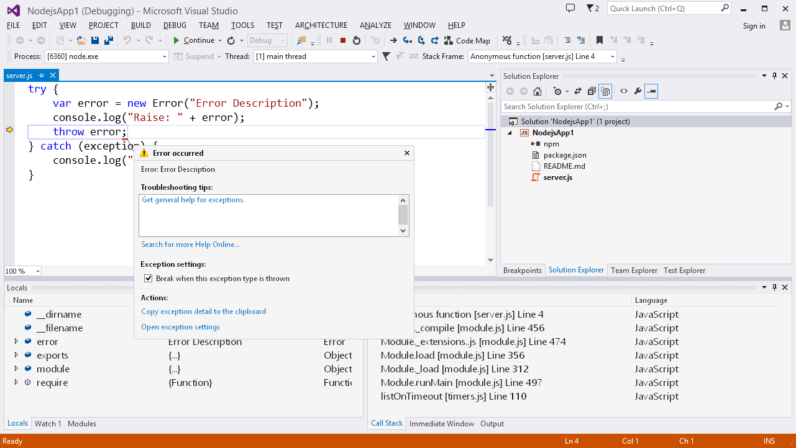

When broken after an exception is hit, the debugger supports the same running state inspection as when broken after stepping, or at a breakpoint (discussed below).

By default, the Node.js debugger breaks on all exceptions, however, the set of exceptions to break on may be modified using the Exceptions window.

You may bring up the Exceptions window from the "Debug\Exceptions..." menu command.

### Running state inspection

When broken under the debugger, you may use the Locals, Watch, Immediate and Callstack windows to inspect the running state of a debugged app.

The **Locals** window provides a view of the current stack frame's parameters and local variables. It also allows expanding objects and arrays to see their members by clicking the '>' expansion indicator

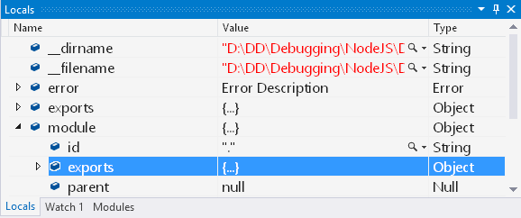

The **Watch** window provides a view of user defined expressions. Other than only including user added items, it behaves much like the Locals window.

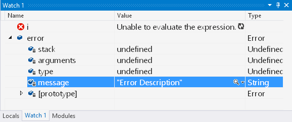

The **Immediate** window behaves much like a debug REPL in that entered expressions are evaluated against the current stack frame and results are printed.

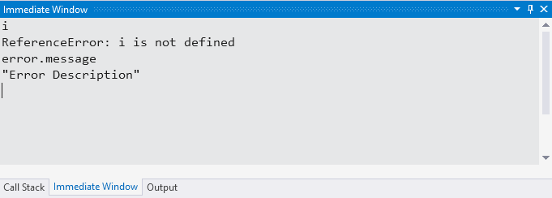

The **Callstack** window provides a view of the callstack for the "instruction pointer" at which the debugger is broken. You may select the stack frame used as context in the other state inspection windows (Locals, Watch and Immediate) by double clicking on a desired stack frame's name.

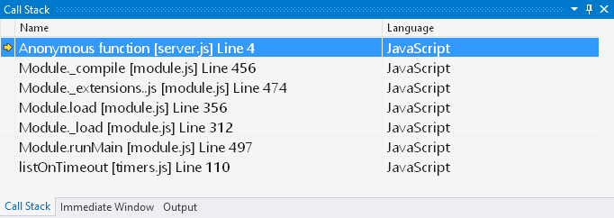

### Hover tips
It is worth noting that hovering over a valid identifier or selected expression in a Node.js code editor while broken in the Node.js Debugger will provide a popup with results from evaluating the identifier or expression. Like the Locals and Watch window, the evaluation results may be expanded to drill into object and array members.

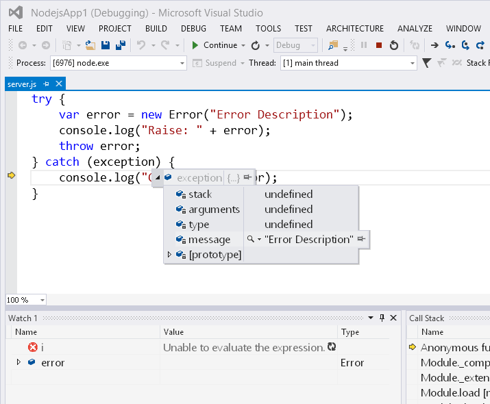

Debugging Options
-----------------

Non-default debugging options may be set from a project's 'General' property page. To access the debugging options, right click on the project in solution explorer and choose '**Properties**'.

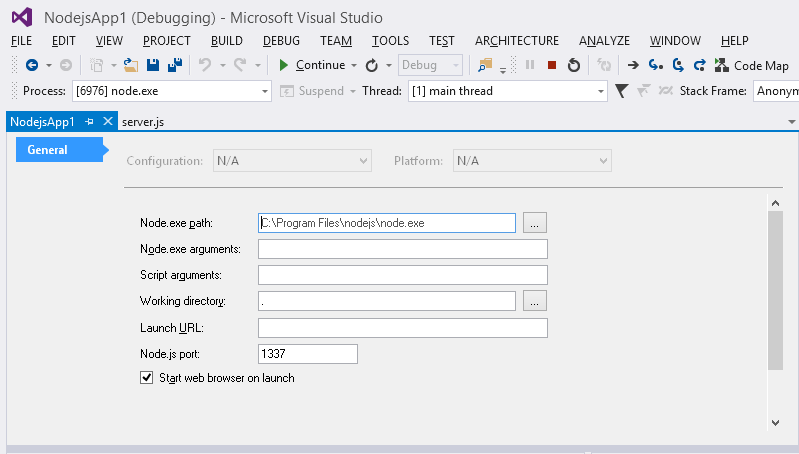

Here you can override the defaults for the following:

- Node.exe to run
- Command line arguments passed to Node.exe
- Arguments passed to the debugged/run script
- Working directory
- Whether to launch a web browser when launching the debugger
- URL to which to navigate a launched web browser
- Node.js port to use -- Note that this defaults to a generated, available port number

Alpha Limitations
-----------------
The Alpha release of the Node.js debugger has the following limitations:

- Closed over variables don't show up in the locals window when broken within a closure.  As a workaround, you may hover over identifiers for closed over variables in the editor, or add them to the watch window. 
- Stepping over "require" of modules with many thrown exceptions (ex. express) is slow when break on exception is enabled.  As a workaround, you may disable all NTVS exception "trapping"  from the 'Debug\Exceptions' dialog.
- As NTVS does not yet include full support for 'Just My Code', break on exception configuration is restricted to BreakAlways or BreakNever.  Given that canned express apps (and derivations) are common and throw handled SyntaxError exceptions, NTVS Alpha has break on exception for SyntaxError set to BreakNever by default.  If you would like to "trap" SyntaxErrors while debugging, you may enable them from the 'Debug\Exceptions' dialog.