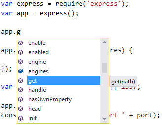
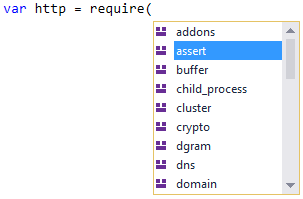
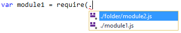
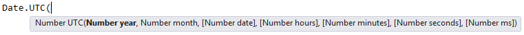

# The Editor

When developing, most of your time is spent in the text editor. Node.js Tools provides a rich editor with functionality to help you be more productive, such as syntax highlighting, identifier and member completion, signature help, method overrides, and search and navigation. A background analysis engine runs your code in the background to determine the possible members of each variable, ensuring that the information provided is accurate and up to date.

Node.js Tools uses the same JavaScript language service as various other JavaScript-based project types in Visual Studio. Please refer to its [documentation](http://msdn.microsoft.com/en-US/library/vstudio/bb385682.aspx) on MSDN for more information.

This section will cover the most commonly used editor features in more detail.

## IntelliSense

IntelliSense exposes results of analyzing your programs in three different forms: completions, signature help, and quick info.

### Completions

Completions are shown as a list of words that may be entered at your current location. The lists are based on the context and are filtered to avoid showing options that are incorrect or distracting. Completions can be shown at any time by pressing Ctrl+J or Ctrl+Space, or may be triggered automatically by certain functions (such as `require`) or operators (such as a period / full stop).

(To prevent completions from appearing automatically, disable Tools -> Options -> Text Editor -> Node.js -> General -> Auto list members. You can still manually show completions by pressing Ctrl+J or Ctrl+Space.)

With a list open, you can search for the completion you want using the arrow keys, the mouse, or by continuing to type. As you type more letters, the list is further filtered to show likely completions.

Member completions are shown automatically when you type a period after a variable or value, and will display the members of the potential values. 

The 'require' argument completion is shown automatically after typing `require` followed by an opening parenthesis, and displays the list of available modules.

By default, only the core Node.js modules and file modules from node_modules are shown in the list. To show modules in the project itself, type period after the opening parenthesis.

### Signature help

Signature help is displayed when writing a function call, and includes any documentation and parameter information that is available. Signature help appears automatically after typing the '(' in a function call, and can be displayed at any time by pressing Ctrl+Shift+Space inside a function call.

(To stop automatically showing signature help, disable Tools -> Options -> Text Editor -> Node.js -> General -> Parameter information. You can still manually display signature help by pressing Ctrl+Shift+Space.)

## Known bugs and issues for alpha

For large projects with lots of packages, Intellisense will sometimes stop working partway through the file.  This is dependent upon how many `require` calls are in the file, and how many other packages the required packages require, as well as the speed of your computer, and the amount of free RAM.