Debugging Node.js running on Linux
==================================

Node.js Tools for Visual Studio (NTVS) supports remote debugging of Node.js processes running on any OS (Windows, Linux, MacOS).

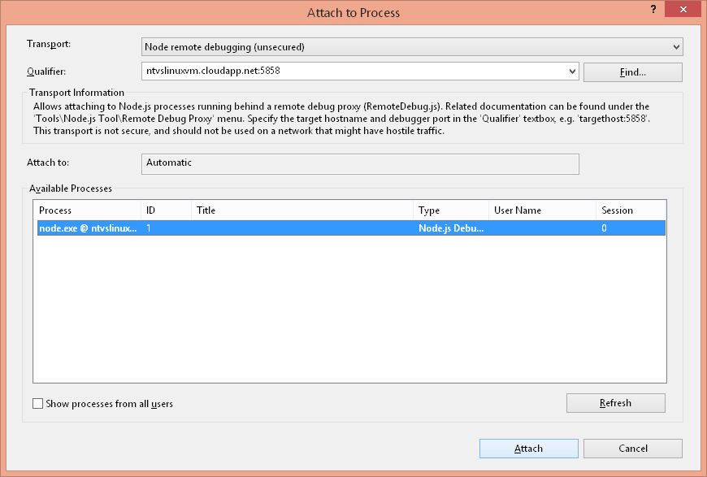

This section describes setup steps which may be taken to allow remote debugging of Node.js processes running on Linux, specifically on a VM provisioned in Azure.

Creating a Linux VM 
--------------------

First log onto the Azure management portal at [https://manage.windowsazure.com](https://manage.windowsazure.com).

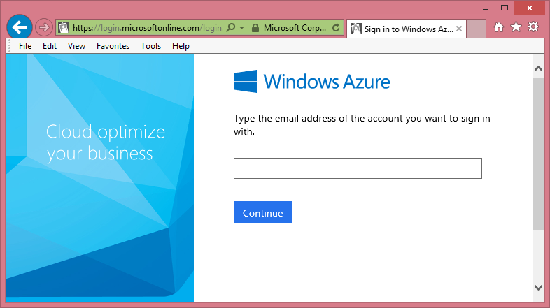

Once logged on, go to the 'Virtual Machines' tab (on the left).

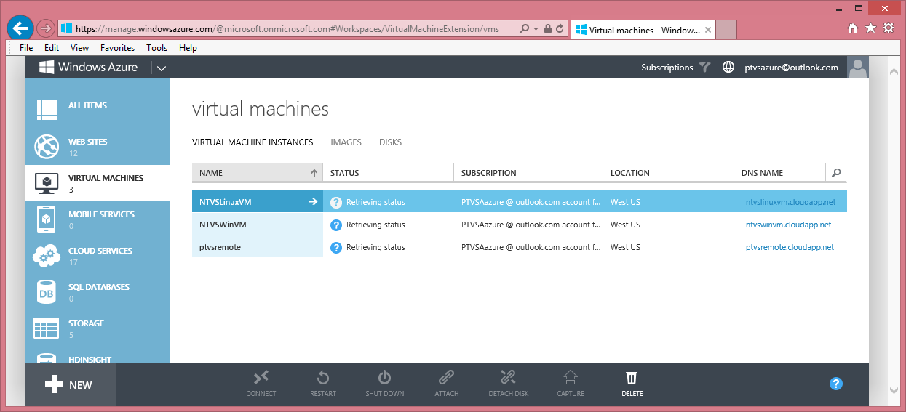

Once on the 'Virtual Machines' tab, choose '+NEW' (at the bottom).  This will bring up the VM creation page.

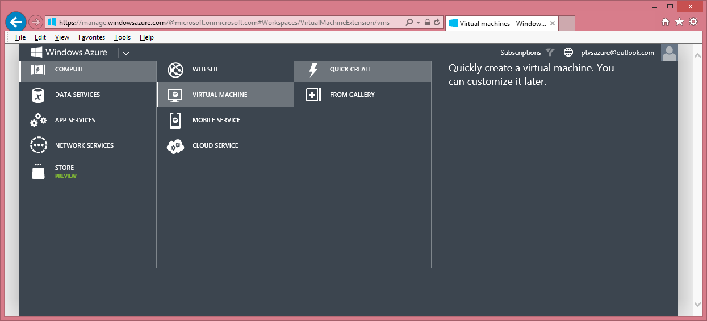

On the VM creation page choose 'COMPUTE\VIRTUAL MACHINE\QUICK CREATE'.  This will bring up a VM creation form.  In the form provide the following and choose **'CREATE A VIRTUAL MACHINE'**:

* **DNS NAME**

	Provide a unique name for your VM

* **IMAGE**

	Choose a Linux image, for example Ubuntu Server 13.10

* **SIZE**

	Choose a VM size

* **NEW PASSWORD/CONFIRM**

	Choose a unique password for the auto generated 'azureuser' account

* **REGION**

	Choose an appropriate region

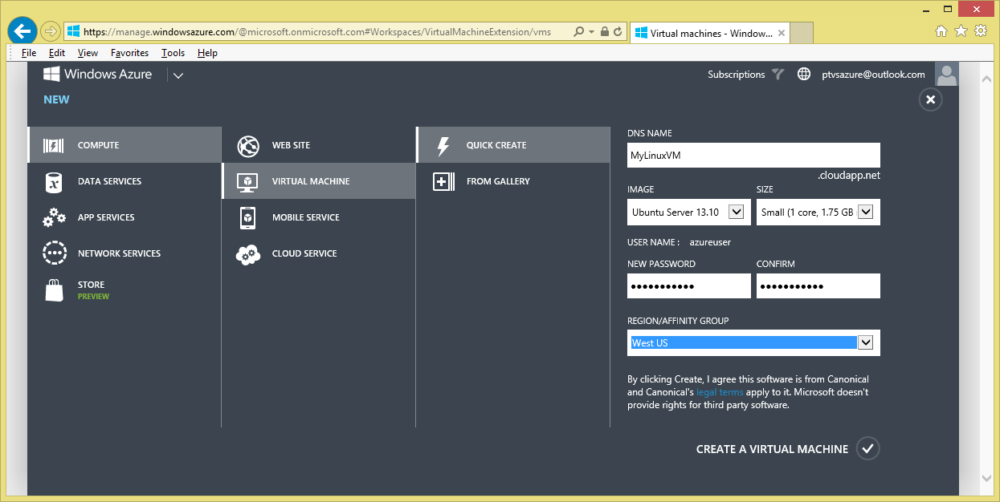

Configuring a Linux VM 
----------------------

Once your Linux VM is up and running you need to add a couple of endpoints to enable remote debugging.  You may go to the VM Endpoint Configuration UI by choosing the VM tab (on the left), then choosing your VM and then choosing 'ENDPOINTS'

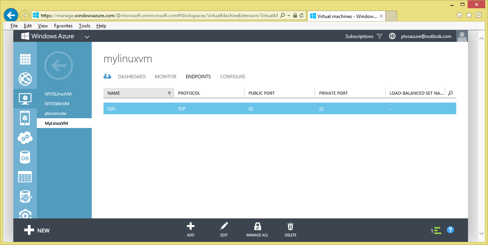

Note that by default the SSH endpoint is already added.  This endpoint is necessary to enable remote access by command line shell and file copy tools like PuTTY and WinSCP.  You will need to add endpoints for both the Node Debugger Protocol (5858 private and public) and HTTP (1337 private to 80 public).  This assumes your Node.js app uses port 1337, by convention.  Add these endpoints as stand-alone endpoints by choosing '+ Add' on the ENDPOINT page (at the bottom) and providing the endpoints' name, protocol (TCP) and public and private ports.

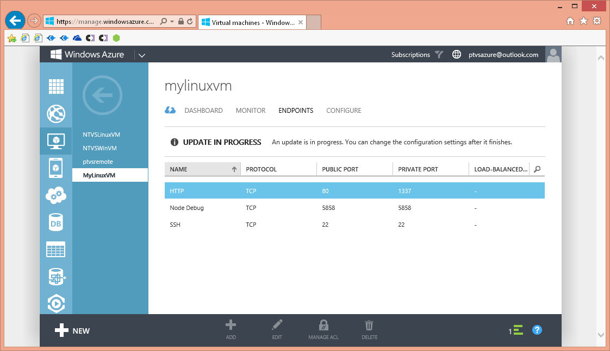

Installing Node.js on a Linux VM
--------------------------------

Using a remote command line shell, like PuTTY ([http://www.chiark.greenend.org.uk/~sgtatham/putty/download.html](http://www.chiark.greenend.org.uk/~sgtatham/putty/download.html)), install Node.js on the Linux VM.  You will need to login to your VM as 'azureuser' with the password you provided when creating the VM.  On the remote command line, install Node.js with sudo.


```
sudo apt-get install nodejs
```

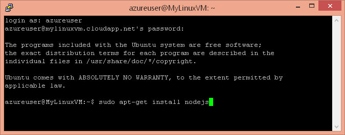

Deploying App and Remote Debug Proxy to Linux VM
------------------------------------------------

Using a remote file copy tool, like WinSCP ([http://winscp.net/eng/download.php](http://winscp.net/eng/download.php)), copy your application to the Linux VM.  Once again you will need to login to your VM as 'azureuser' with the password you provided when creating the VM.  In addition, copy the remote debug proxy (RemoteDebug.js) to your VM.  To find the remote debug proxy from VS, use the 'Tools\Node.js Tools\Remote Debugging Proxy' menu.  It is typical to place the proxy in the same folder as the script to debug.

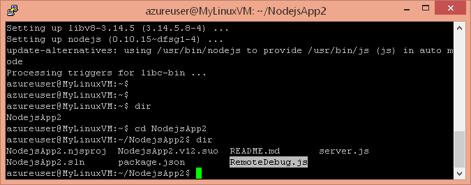

Running App Behind Remote Debug Proxy
-------------------------------------

Back in your remote command line shell, run your app behind the remote debug proxy by running nodejs on the remote debug proxy and passing your app's startup script on the command line.


```
nodejs RemoteDebug.js server.js
```

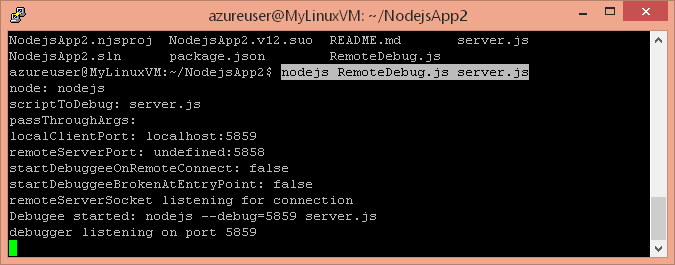

Now your app is running behind the remote debug proxy and Node.js debugger protocol is accessible over public port 5858.  You are ready to remotely attach.

Attaching the NTVS debugger
---------------------------

Attaching the NTVS debugger entails walking through the VS "Attach to process" UI. The steps are as follows:

* Launch the "Attach to process" dialog from the 'Debug\Attach to Process' menu

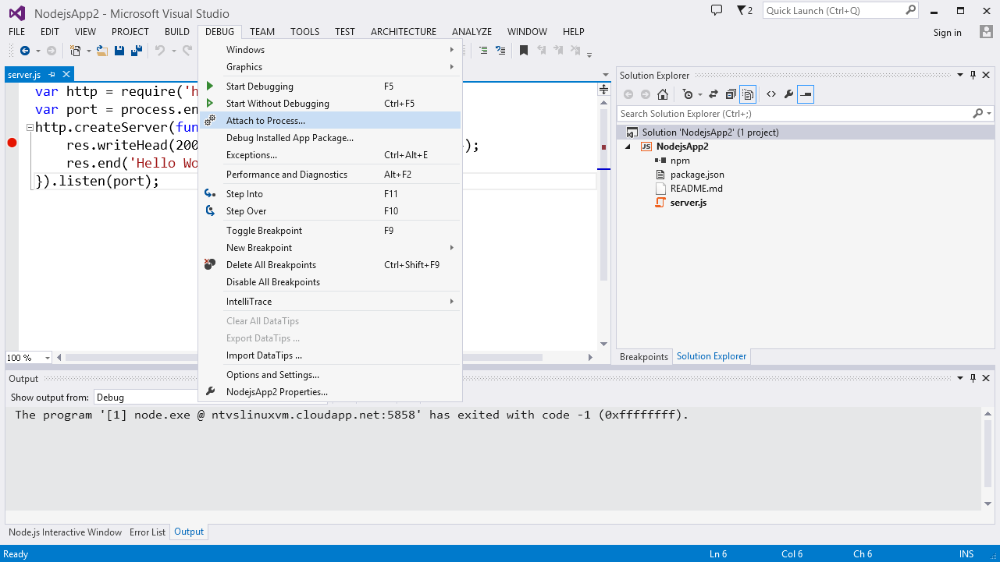

* For 'Transport', choose 'Node remote debugging'

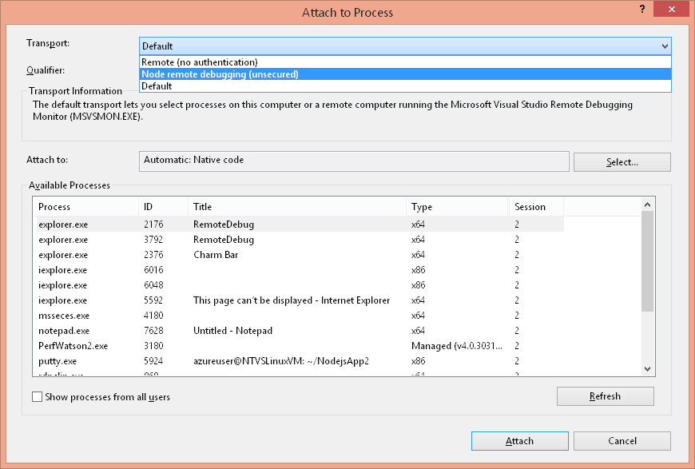

* For 'Qualifier', provide the target host and debugger port (ex. myhost:5858) and hit 'Refresh'

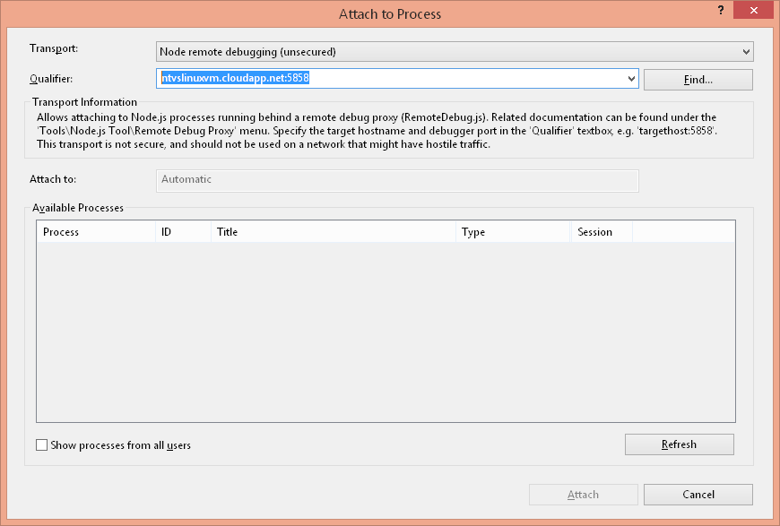

* In 'Available Processes' select the target node.exe process and choose 'Attach'


Unless you immediately hit a breakpoint, the only indication that the debugger has succesfully attached is that it will indicate "Running' in the title bar.  

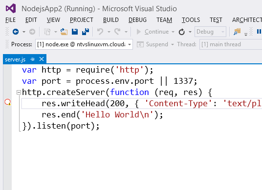
