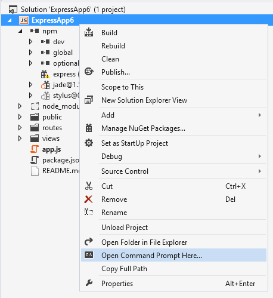
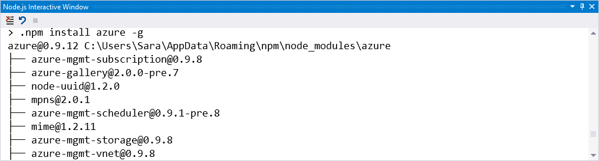
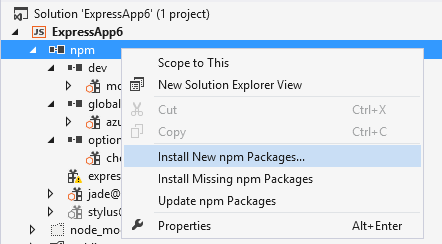
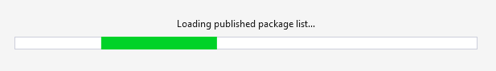
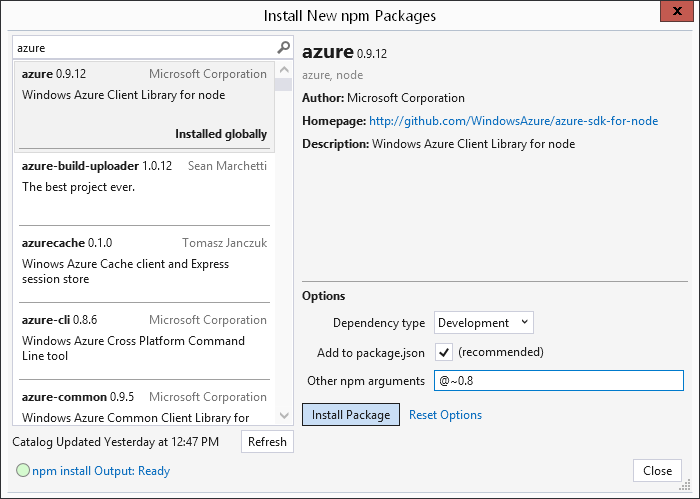
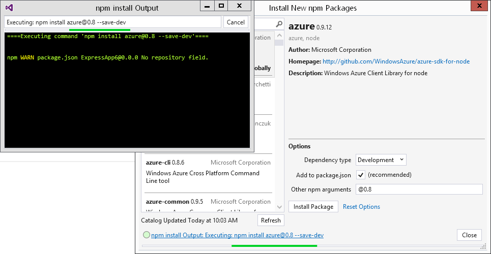
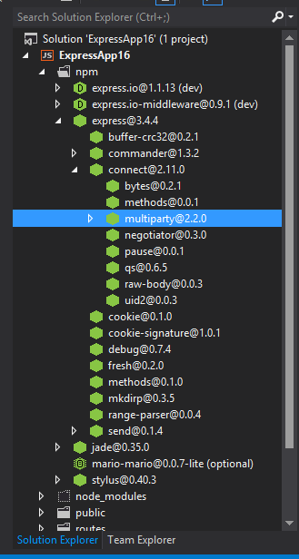
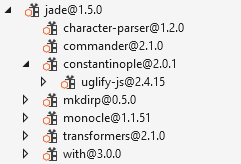
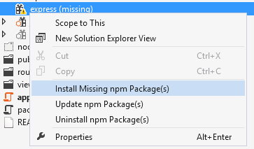
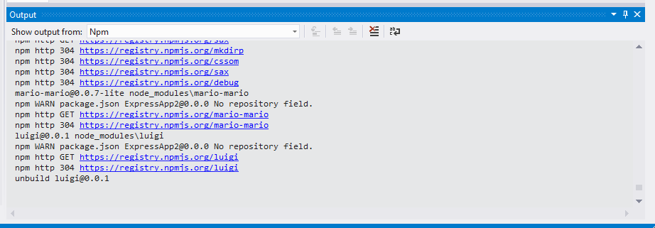

## npm

One of the best things about Node.js is its extensive package ecosystem. **npm** allows you to install and manage packages for use in your Node.js apps (among other things). We'll assume you're familiar with basic npm functionality, otherwise check out [npmjs.org](http://npmjs.org) to learn more.

There are several ways you can work with npm in Node.js Tools for Visual Studio:

1. [```npm``` in the Command Prompt](#npm-in-the-command-prompt) - for running npm the good ol' fashioned way (in cmd.exe)
2. [```.npm``` in the Node.js Interactive Window](#npm-in-the-nodejs-interactive-window) - for running npm without leaving Visual Studio
3. [npm install GUI](#browsinginstalling-new-npm-packages-in-the-gui) - for browsing/installing packages from the npm repository
4. [Solution Explorer](#managing-installed-packages-in-solution-explorer) - for viewing/managing installed packages
5. [npm log in Output Window](#npm-log-in-output-window) - for viewing the output of npm commands in your Visual Studio session

All of them will work together and synchronize with the project system. Let's take a look.
[video:"npm in NTVS Walkthrough" SaOnGN6byeo 0.5]

### npm in the command prompt

The easiest way to open a command prompt in the correct location is to right-click your **Node.js** project in **Solution Explorer**, then click <span class="menu">Open Command Prompt Here...</span> on the context menu. You'll be able to run npm commands in your project directory assuming npm is in your path.



### .npm in the Node.js Interactive Window

If you're addicted to the npm command line interface, you'll feel right at home with the ```.npm``` command in the Node.js Interactive Window <span class="menu">Tools</span> → <span class="menu">Node.js Tools</span> → <span class="menu">Node.js Interactive Window</span>. It does exactly what you would expect - run npm commands from the Interactive Window. For instance...

```
> .npm install azure -g
```




By default, npm will execute in your project's home directory. If you have multiple projects in your solution (or want to execute in a different path,) you'll need to specify the name (or path) of the project in brackets:

```
> .npm [MyProjectNameOrPath] install azure@4.2.3 -g
```

*Known Issue:* the ```.npm``` command is currently unavailable for folders that do not have a package.json file. To initiate commands like npm init (which creates a package.json file,) simply right click your project's Solution Explorer node, and open up the command prompt. 

### Browsing/Installing new npm packages in the GUI
*Refreshed in NTVS 1.0 Beta 3*

If you don't know the exact command, want to browse through available packages in the npm registry, or simply prefer a <s>gooey</s> graphical user interface, right click on the Solution Explorer npm node, and select <span class="menu">Install New npm Packages...</span>



The first time you open the dialog, it'll start downloading the entire npm catalog. It's a 50MB+ download, so if you're impatient, you can close the dialog and wait for the download to complete while you perform other tasks (current status prints to the [npm log in the Output Window](#npm-log-in-output-window)).



The package cache is now stored in a database, so so future refreshes are iterative. If you've tried to refresh a couple times with no luck, we suggest clearing your cache first by navigating to <span class="menu">Tools</span> → <span class="menu">Options</span>Options> → <span class="menu">Node.js Tools</span> → <span class="menu">Npm</span>.


Otherwise, take a look at the [npm log in the Output Window](#npm-log-in-output-window) for more detail about what went wrong.

Once the catalog finishes loading, search for a package, specify options, and install. For instance, if you'd like to install azure, approximately version 0.8, and list it in your devDependencies in package.json:

- **Dependency type:** Development
- **Add to package.json:** Yes (if you uncheck this, it will be installed as a standard dependency instead because there is no concept of devDependencies without package.json. Similarly, this flag will be ignored if you select the ```global``` dependency type)
- **Version:** latest (alternatively select a version if the version you want is in the list - only versions as recommended by dist-tags are available.)
- **Other npm arguments:** ```@~0.8``` (we'll honor your version-related arguments here, so long as Version is specified to be ```latest```)


The corresponding npm command is:

```
npm install azure@~0.8 --save-dev
```





If the status indicator in the lower left hand corner indicates an error and/or if you wish to view more details about the install, you can click on the link to open the npm install Output Window.




Note that npm will continue running in the background when you close the dialog (npm output will be printed to the [npm log in the Output Window](#npm-log-in-output-window).)


### Managing Installed Packages in Solution Explorer
Edits to package.json and package install status are reflected in the npm Solution Explorer node.



For reference, the corresponding package.json specifies its dependencies as follows:

```json
    "dependencies": {
    	"express": "3.4.4",
    	"jade": "*"
    },
    "devDependencies": {
    	"mocha": "^1.21.0"
    },
    "optionalDependencies": {
    	"chess": "^0.2.1"
    }
```
**Package status:**

-  Installed and listed in package.json
-  Extraneous (installed but not in package.json)
-  Missing (not installed, but listed as a dependency in package.json)

**Dependency type:** standard packages appear directly under the npm node, whereas your other packages (```global```, ```devDependencies```, ```optionalDependencies```) appear under their corresponding subnodes. bundledDependencies are labeled "[bundled]"

Expand package nodes to browse their dependencies. 



Of course, that's not all you can do... Right click on a package node or the npm node to take action:

- **Install missing package(s)** if they're listed in package.json
- **Update package(s)** to the latest version
- **Uninstall a package** uninstalls package and removes from package.json (only available on package nodes)


    

Note that these options are unavailable for sub-modules.

### npm log in Output Window
If you've already installed some packages you'll have seen that we capture and display the **npm** output for the current command. However, you can also view the **npm** output for your entire *Visual Studio* session (note that npm output from Interactive Window or commpand prompt is not reflected.) To see this:


1. Open <span class="menu">View</span> → <span class="menu">Output</span>

2. In the **Show output from** dropdown, select **Npm**.

3. You should see something similar to the following:


	


This is handy for debugging your own npm-related issues (and helping us debug ours.)

### Happy package-managing!
Comments, compliments, complaints? We'd love to hear your feedback - please file an [issue](https://nodejstools.codeplex.com/workitem/list/basic), comment below, or post on the [forums](https://nodejstools.codeplex.com/discussions).

