## npm

**Npm** is **Node**'s package manager and allows you to install packages for use in your Node apps. You can install packages from the public **npm** repository, as well as packages you've authored yourself.

*Node Tools for Visual Studio* provides an easy to use interface to **npm** and, over the coming months, will significantly expand **npm** integration within *Visual Studio*.

## Managing installed packages with npm

### The npm Package Management dialog

To use **npm** in your *Node Tools for Visual Studio* project, right-click on the **npm** node in **Solution Explorer**, then click **Manage npm Modules**.

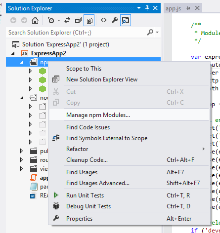

This will bring up the **npm Package Management** dialog. In here you can manage local packages, which are available only to your application, as well as global packages, which are available to all **Node** applications. Additionally, you can quickly and easily search and install packages from the public **npm** repository which, as of this writing, contains over 48,000 packages!

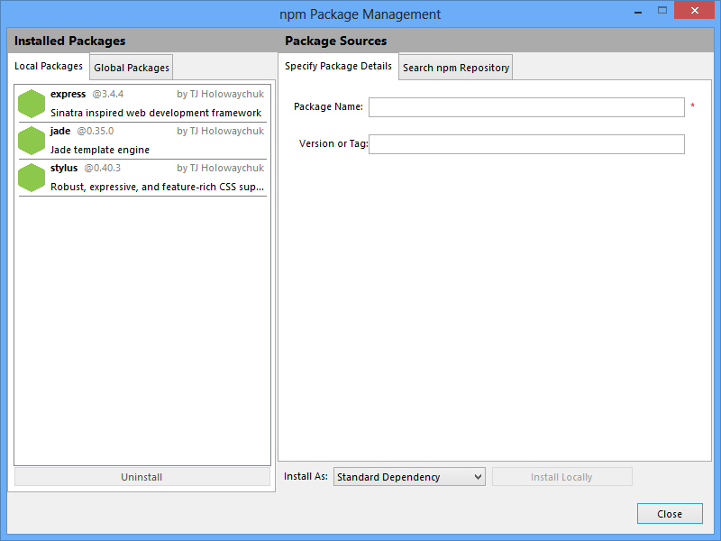

The **npm Package Management** dialog is divided into two main areas. On the left you can see packages that are installed, with separate tabs for local and global packages, whilst on the right you can see tabs that allow you to install packages.

### Local and global packages

If you created a blank **Node** project the **Local Packages** tab will be empty. If on the other hand you used, for example, the express template you should see that some packages have automatically been included in your project.

Local packages are available only to your application, and each application you create will have its own copies of whatever local packages you install. Thus it's perfectly fine to have different applications depend upon different versions of a given package.

As its name suggests, the **Global Packages** tab contains Node packages that have been installed globally and are therefore available to all applications. Depending upon whether or not you already have some **Node** applications installed on your machine that have installed global packages, this list may or may not be empty.

You should be careful about making changes to global packages because these changes can impact other applications and may stop them working properly, or indeed at all. The **npm Package Management** dialog will therefore warn you when you are operating on global packages, as shown below.

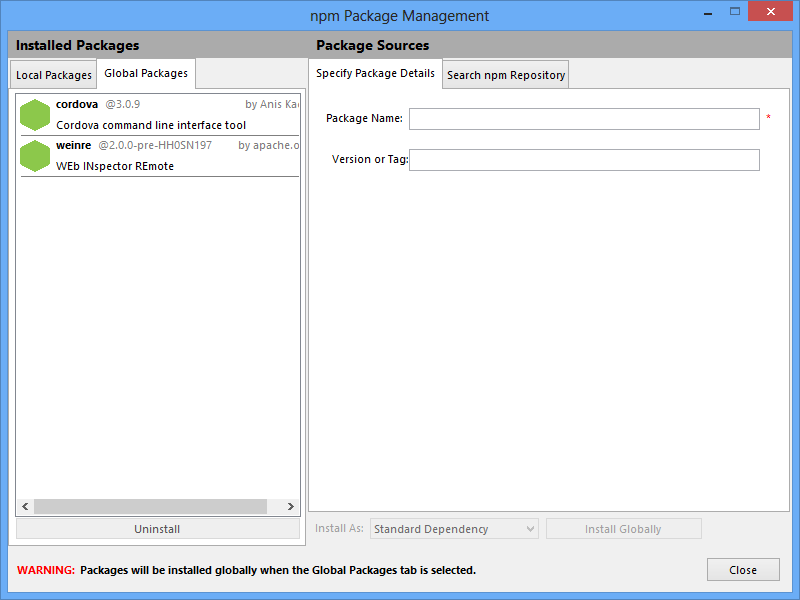

You should also beware that some packages do not work well when installed globally, whereas for some a global install is preferred. If you are unsure whether to install a package locally or globally, refer to its documentation.

We recommend that in general you install packages locally first and only install them globally where absolutely required.

### Installing packages by name (and version)

If you already know the name of the package you want to install the easiest way is to do this by name.

1. In the **npm Package Management** dialog, click on either **Local Packages** or **Global Packages**, depending upon whether you want to install a local or global package.

2. Click on **Specify Package Details**. You'll see a pane, as follows, that allows you to enter the details of your package:

	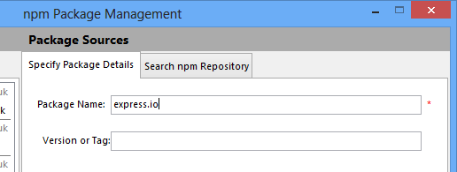

3. Enter the package name in the **Package Name** field.

4. Optionally, enter the version or tag that you'd like to install. If you leave this blank the latest version of the package will be installed. Note that you can enter a version range here, as described at [https://npmjs.org/doc/install.html], but that **npm install** will not write this range to your *package.json* file - it will only write the version that it actually installs. If you wish to specify a version range in *package.json* you should edit the file directly.

5. Click **Install Locally** or **Install Globally** to install the package.

6. A window will appear showing npm's progress and log, including any errors that occur during installation.

	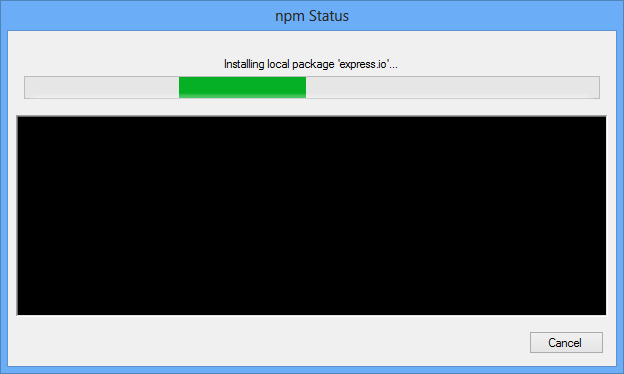

	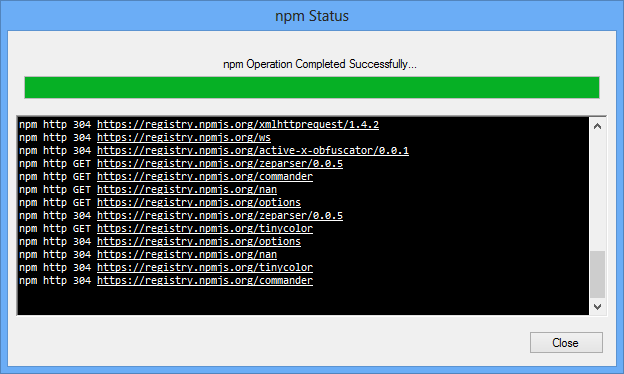

	Note that whilst you can cancel the installation this is *not* a transactional operation and will generally leave you with a partially installed package hierarchy. Fortunately this is easy to fix: please see **Troubleshooting** below.

7. Click **Close** on the progress window.

### Using npm search to install packages

Searching npm's package repository can often be the best way to find and install packages, since many of them have similar names, especially those that are related.

1. In the **npm Package Management** dialog, click on either **Local Packages** or **Global Packages**, depending upon whether you want to install a local or global package.

2. Click on Search npm Repository. The search pane will appear. If this is the first time you've opened the **npm Package Management** dialog during your session you'll see that the repository catalog is being downloaded. Eventually we'll cache the catalog between sessions to allow for quicker searching right away. You'll still be able to trigger a refresh from the **npm** repository whenever you need to.

	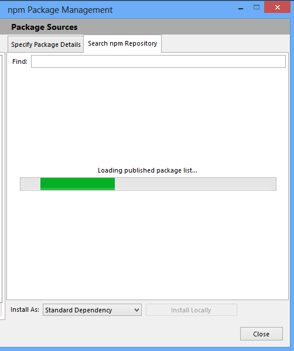

3. Enter your search term in the **Find** field. Once the module catalog list has populated it will filter automatically as you type.

	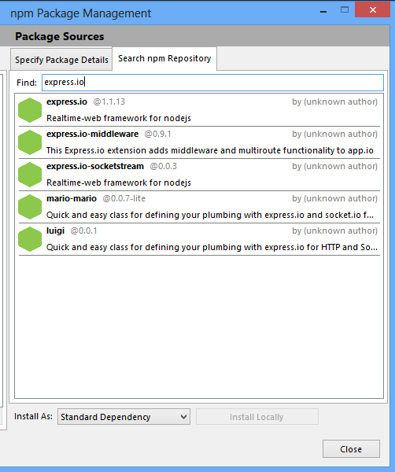

4. Click on the module in the list that you would like to install to select it.

5. Click **Install Locally** or **Install Globally** to install the package.

6. A window will appear showing npm's progress and log, including any errors that occur during installation.

	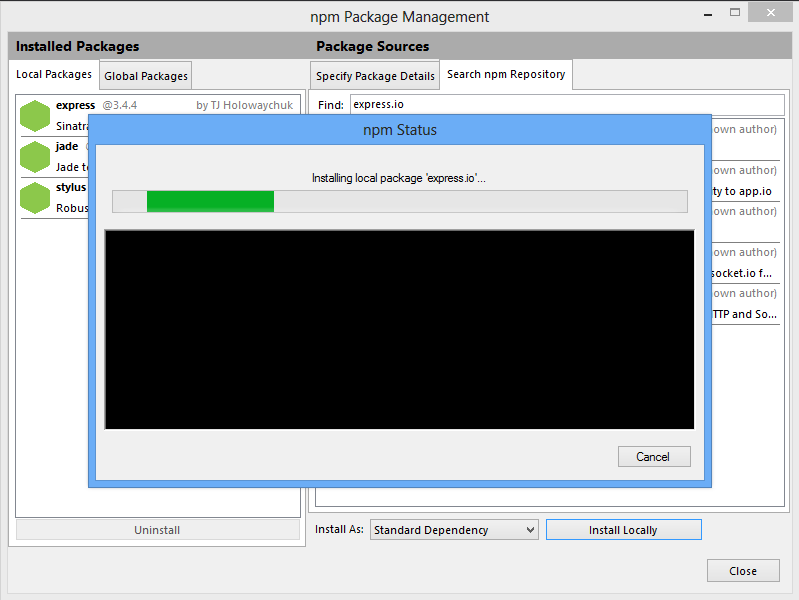

	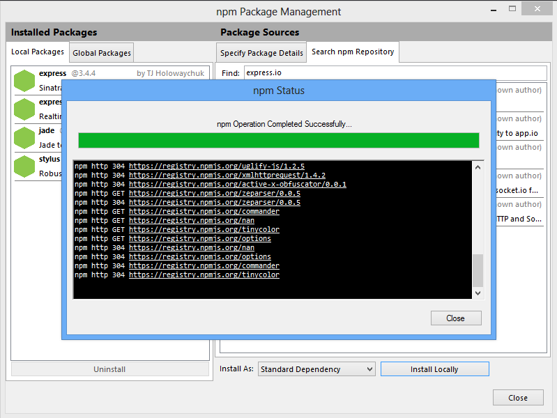

	Note that whilst you can cancel the installation this is *not* a transactional operation and will generally leave you with a partially installed package hierarchy. Fortunately this is easy to fix: please see **Troubleshooting** below.

7. Click **Close** on the progress window.

### Working with dev, optional, and bundled dependencies

Mostly the packages you install will appear in the **dependencies** collection in your project's package.json file. These are the dependencies that *must* be installed for your app to work.

This will generally be what you want, but npm also supports two special types of dependency:

- **Dev dependencies**: These are packages that are only use for developing your app. A good example would be a package for unit testing.

- **Optional dependencies**: These are packages that allow your app to provide additional functionality but, without which, it will still work with gracefully degraded function. **Note that it is YOUR responsibility to check whether or not optional packages are installed in code and gracefully handle the situation where they are not.**

To install dev and optional dependencies use the **Install As** dropdown at the bottom of the **npm Package Management** dialog. (Note that this is only available when **Local Packages** is selected, since it makes no sense for global packages.)

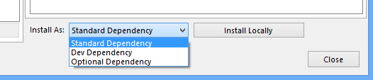

This dropdown has three values:

- **Standard Dependency**: packages are required to run your app and will be added to the **dependencies** collection in *package.json*.
- **Dev Dependency**: packages are required only for development and will be added to the **devDependencies** collection in *package.json*. Packages should *not* be required to run your app.
- **Optional Dependency**: packages are not required to run your app, but may enable richer functionality if installed, and will be added to the **optionalDependencies** collection in *package.json*. Packages should *not* be required to run your app.

To install a package as a dev or optional dependency just select the appropriate value in the combo before you click **Install Locally**.

Dev and optional dependencies are listed with a different icon from normal dependencies in both the **npm Package Management** dialog and **Solution Explorer**.

Bundled dependencies are listed by name only in the **bundledDepencies** list in *package.json*. As their name suggests, they will be bundled with your app when you publish it as a package.

The main advantage of doing this is that it should lead to reliable deployments, since you will always know that deployed packages will be the same versions used for development by all members of your team. The downside is that they will significantly increase the size of your package.

In general, therefore, you should *not* bundle dependencies when publishing packages to the public npm repository.

*NTVS* currently recognises bundled dependencies, and will highlight them as such in **Solution Explorer** (see **The npm node in Solution Explorer** below), but does not yet provide any support for configuring them. Therefore, to configure bundled dependencies you should edit *package.json* directly.

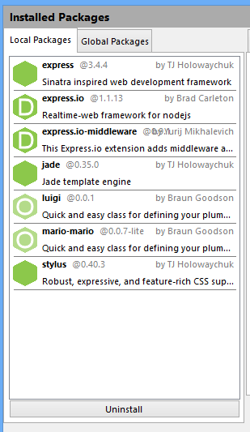

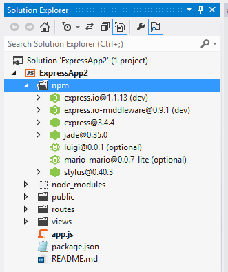

### Uninstalling packages

To uninstall a package from your project:

1. In the **npm Package Management** dialog, click on either **Local Packages** or **Global Packages**, depending upon whether you want to uninstall a local or global package.

2. In the list of installed packages, select the package you'd like to uninstall.

	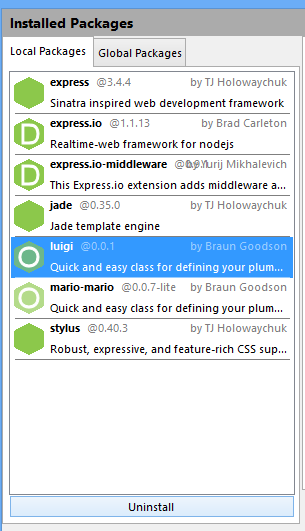

3. Click **Uninstall**.

4. A window will appear showing npm's progress and log, including any errors that occur during uninstall. Generally the log is much less extensive than for an install.

	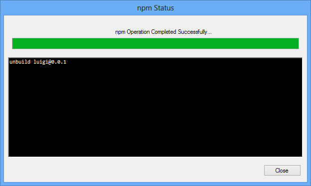

	Note that whilst you can cancel the uninstall this is *not* a transactional operation and will generally leave you with a partially uninstalled package hierarchy. Fortunately this is easy to fix: please see **Troubleshooting** below.

5. Click **Close** on the progress window.

### The npm node in Solution Explorer

The **npm** node in solution explorer provides a high-level view of the packages installed in your Node app. You can also drill further into these packages to see which other packages they depend upon.

Various different icons are used to indicate the type and status of the packages you have installed.

-  - installed package that is listed in *package.json*.

-  - installed package that is listed in *package.json* and marked as a bundled dependency.

-  - installed package listed as a dev dependency in *package.json*.

-  - installed package listed as an optional dependency in *package.json*.

-  - installed package not listed as a dependency of any type in *package.json*.

- 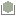 - installed package not listed in **dependencies**, **devDependencies**, or **optionalDependencies** in *package.json* but nevertheless marked as a bundled dependency.

-  - dependency listed in *package.json* but corresponding package not installed.

-  - bundled dependency listed in *package.json* but corresponding package not installed.

-  - dev dependency listed in *package.json* but corresponding package not installed.

-  - optional dependency listed in *package.json* but corresponding package not installed.

Notes:

- Missing dev and optional dependencies of sub-packages are not shown. This is to avoid polluting Solution Explorer with large numbers of irrelevant nodes since many packages in the repository have both dev and optional dependencies that will not be downloaded by npm when they are installed.

- You can obviously install and uninstall packages both from within *Visual Studio* using the **npm Package Management** dialog, and from the command line. The **npm** node will track your changes regardless of how you make them, but you may sometimes notice a short delay before the tree updates.

- If you need to run npm from the command line, the easiest way to do this is to right-click on your **Node** project node in **Solution Explorer**, then click on **Open Command Prompt Here** in the context menu.

### Viewing the npm log

If you've already installed some packages you'll have seen that we capture and display the **npm** output for the current command. However, you can also view the **npm** output for your entire *Visual Studio* session. To see this:

1. Click **View > Output** on the *Visual Studio* main menu.

2. In the **Show output from** dropdown, select **Npm**.

3. You should see something similar to the following:

	

The exact content of the log will obviously depend upon what actions you have performed.

Note that we do not include the npm output from the repository catalogue retrieval simply because it's huge and not terribly interesting.

## Troubleshooting

### I see a message that says npm cannot be found

If you see this it means that either **Node.exe** is installed in a non-default location on your system, and isn't on your **PATH**, or that it's not installed at all.

If you need to install **Node** you can download it from [http://nodejs.org/](http://nodejs.org).

If you already have it installed you just need to tell *NTVS* where to find it. To do this:

1. Right-click on the project node for your **Node** project in **Solution Explorer**.

2. Click **Properties**.

3. Specify the location of **Node.exe** by browsing or typing the location into the **Node.exe path** field.

4. Right-click the **npm** node in **Solution Explorer**.

5. Click **Manage npm Modules** to reopen the **npm Package Management Dialog**.

You should now be able to install and uninstall packages. NTVS uses the location of **Node.exe** to work out where to find **npm.cmd**. Node has included **npm** since version 0.6.3. If you are using an earlier version of node you should consider upgrading! If you have to install **npm** manually you should ensure that **npm.cmd** is installed in the same directory as **node.exe** otherwise *NTVS* won't be able to find it.

### How do I install missing modules?

In this release there is no **npm install** support for installing missing modules. **This will be available in the beta and, before that, within dev builds.**

There are two options to workaround this:

1. Install missing modules from the command line by executing **npm install** with no arguments in your Node project's directory. To open a command prompt in the correct location, right-click on your **Node** project in **Solution Explorer**, and then click **Open Command Prompt Here** on the context menu.

2. Open up the **npm Package Management** dialog, select the **Local Packages** tab, go to **Specify Package Details** and, for each missing package, enter the package name in the **Package Name** field and click **Install Locally**.

### YAAARGH! I cancelled a package install/uninstall and now I have a partially installed/uninstalled package in my project. What do I do?

If **npm** fails to install a package it will often be able to rollback the operation so that your packages are in their previous state.

If, however, you cancel an **npm** operation you are simply killing the process, so no rollback occurs. This means that you will usually end up in a situation where a package is partially installed or uninstalled.

Fortunately this is not a huge problem. You can fix it by:

- Uninstalling the package, either in the **npm Package Management** dialog, or via the command line.

- Manually deleting the package directory from the filesystem - again, you can do this in *Visual Studio*'s **Solution Explorer**, from the command line, or in *Windows Explorer*.

- Installing the package, either in the **npm Package Management** dialog, or via the command line, which will restore the package and any damaged/partially removed sub-packages.

The easiest way to open a command prompt in the correct location is to right-click your **Node** project in **Solution Explorer**, then click **Open Command Prompt Here** on the context menu.

In a future release of *Node Tools for Visual Studio* we may implement an explicit rollback when you cancel an **npm** operation if enough people request it.

## Coming Soon

- Install all packages in *package.json* with **npm install**, and install missing packages in **npm Package Management** dialog without having to first uninstall them.

- Caching of **npm** repository catalogue to speed searches on first run of the **npm Package Management** dialog within a session.

- Update dependencies in *package.json* to match modules installed on filesystem.

- Detection of "out of date" packages and update to latest versions with **npm update**.

- Uninstall packages directly from **Solution Explorer** context menu.

- *package.json* editor.

- Install packages from tarballs, folders, and URLs.

- Support for bundled dependencies - very useful for reliable deployment of **Node** apps.

- Publishing to the **npm** repository.
