## Profiling


Node.js Tools for Visual Studio takes advantage of V8 Profiling API's as well Visual Studio's Reporting features to give you a sense of where your program is spending its time. Here's a short program to illustrate:

```javascript

var http = require('http');
var n = 0;
function spin1(count) {
	var x=0; 
	for (var i=0; i<count; i++) {
		x+= Math.sqrt(x)/Math.sqrt(x+1) + Math.random();
	} 
	return x; 
}

function spin2 (count) { ... } // same code as spin1
function spin3 (count) { ... }

port = 1337;
		
http.createServer(function (req, res) {
    res.writeHead(200, {'Content-Type': 'text/plain' });
    var s1 = 0; var s2 = 0; var s3 = 0; 
    s1 = spin1(1000000); s2 = spin2(3000000); s3 = spin3(6000000);
    res.end( ' n=' + n++ + ' s1=' + s1 + ' s2=' + s2 + ' s3=' + s3);
	
}).listen(port);
```


The code calls three identical functions spin1, spin2, spin3 to do similar work. Each function is called with 1M, 3M, 6M as parameters respectively.

## Start your profiling session:

### 1. Set your port # if necessary

```
port = 1337;
```

### 2. Launch Node.js profiling


Note that Node.js has its own specific menu item under the Analyze menu

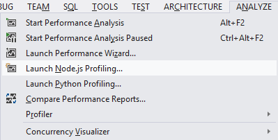 


By default the current Open project is selected.  You can also select a specific script.  Click Start:

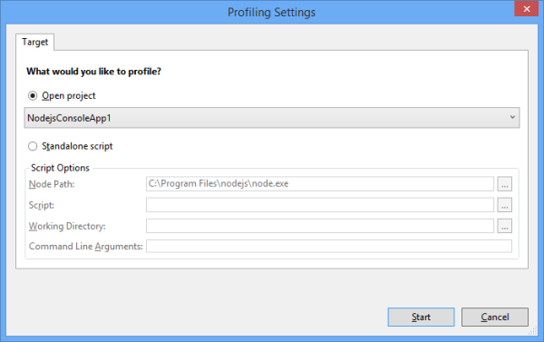

### 3. Refresh the browser

Switch to your browser, localhost:1337.  Hit F5 a few times to get some samples:

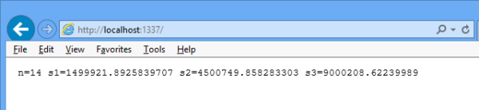 


**Note**: if your functions don't do much work, they will not show up in the profile!

### 4. Exit node
Now kill node to start processing the profile data.  This may take from seconds to minutes, depending  on the amount of samples collected:

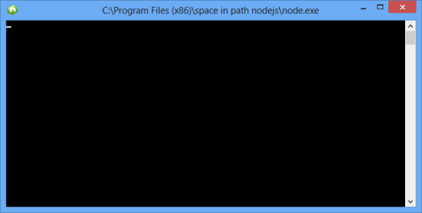 


### 5. View the Profile
This is the Summary view you will see first and it will give you a standard time line vs CPU overview:

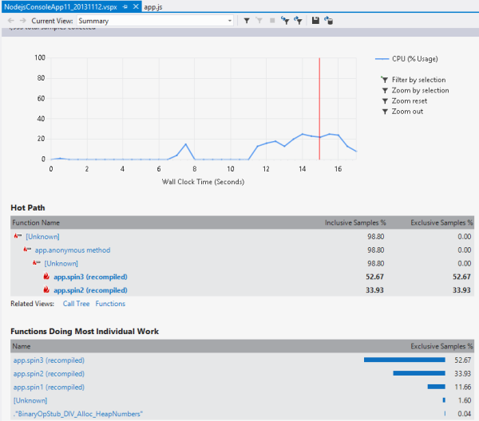 

- You can immediately see the hottest path in your code
- You can also see which functions take the most time
- Note that functions that were re-JITed are marked with "recompiled"


A useful initial view is “Functions”.  Here we see the three spin functions displayed.  If the functions called other function, you'd see the Inclusive/Exclusive amounts displayed as well (but see warning below):

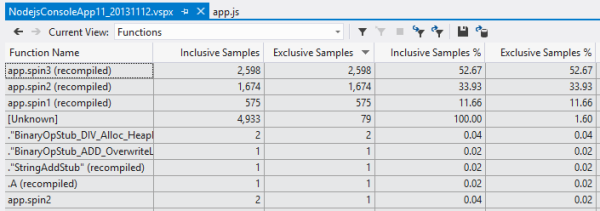 


Here's the Call tree view:

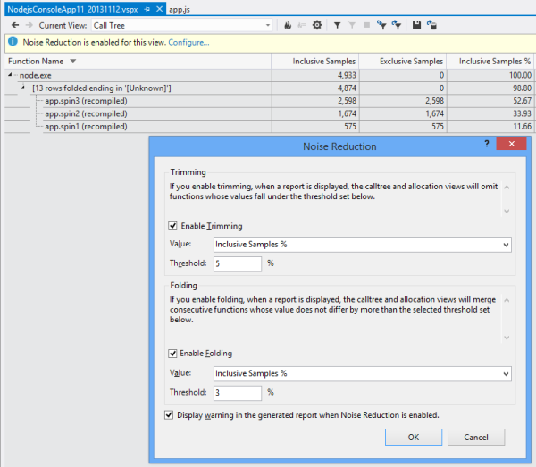

The Calltree view can include a lot of noise which you can get rid off by choosing Configure and selecting thresholds for Trimming and Folding. 

Yet another useful view is the Caller/Callee relationship.   Here you can select a function and see who called it and what it called.  See below about "Unknown" functions.

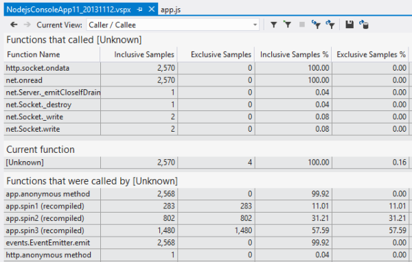 


If you click on a particular function, you can see the Function Details, along with its source:

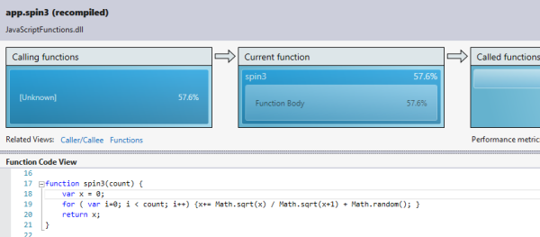 

You can filter the perf data in multiple ways.  One way is to simply drag a region in the summary view graph and selecting Filter by Selection:

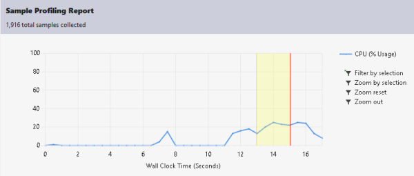 


Another is to use a filter expression and choose particular fields and values to narrow down the data:

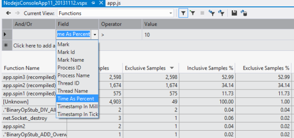 


Finally, you can compare reports from different runs to see how your code change affected performance.  Select Compare Reports and specify the two perf files.  You can selected which Tables, Columns and set a Threshold to filter the display:

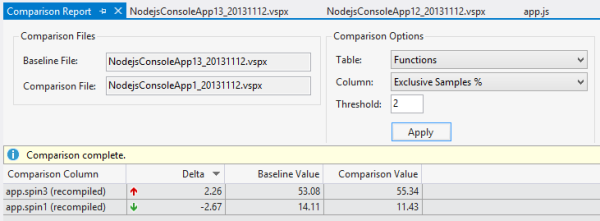 


## Using an existing V8 log:

In the NTVS profiling installation folder:

```
C:\Program Files (x86)\Microsoft Visual Studio 12.0\Common7\IDE\Extensions\Microsoft\Node.js Tools for Visual Studio - Profiling\1.0
```

There's a command-line utility `Microsoft.NodejsTools.NodeLogConverter.exe` that is used internally by NTVS to convert a V8 log into a Visual Studio profiling report (.vspx) file.

Usage: `[/jmc] <v8.log path> <output.vspx path> [<start time> <execution time>]`

- /jmc enables just my code option

- Start time is actually unused, so you can pass anything (zero) for that parameter

- Execution time is a non-zero value, in CLR TimeSpan format: `[-][d.]hh:mm:ss[.fffffff]`

You can use this utility to create a profiling report from an existing v8.log file, then drag & drop the .vspx file into Visual Studio to view the profiling report.

Example:

```
node --prof server.js
Microsoft.NodejsTools.NodeLogConverter v8.log report.vspx 0 00:01:30
```

## Caution about Profiling and Optimization:
There are a few points to keep in mind when Profiling node/V8:

- V8 performs various optimizations such as inlining, dead code elimination, code motion, re-JIT'ing, etc. that will strongly affect the profiler's accounting.  
- Methods that don't do much work will not show up in the profiling report. 
- When V8 profiles and re-JITs a method it's tagged "recompiled" in the profile report.  You may see multiple entries for the same method.
- Currently some methods are marked as "Unknown".  These represent native code for which no name is reported by V8.

