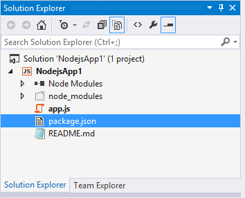
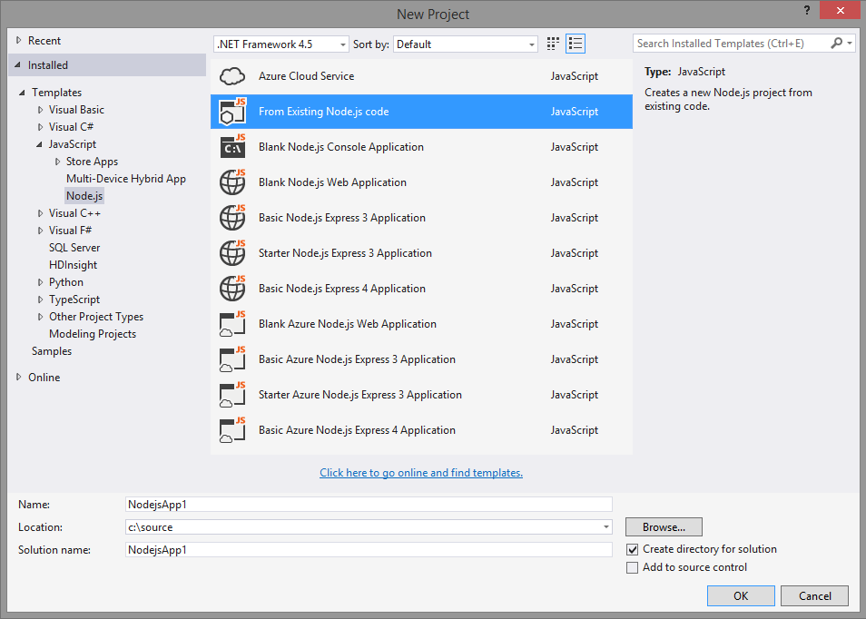
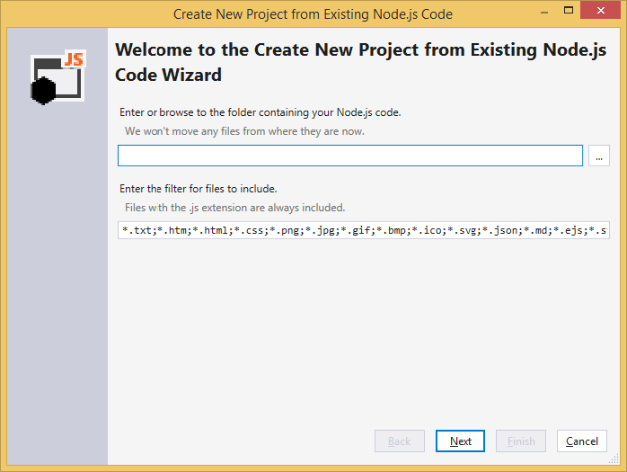
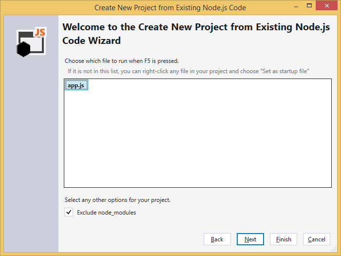
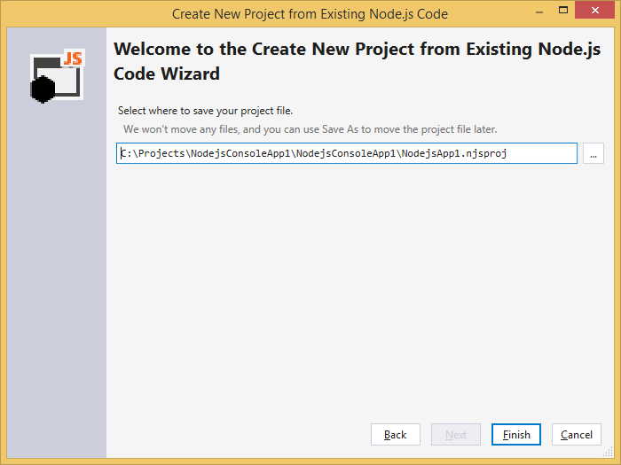

Projects
========

--(

>>

Node.js Tools allows you to create projects using the Visual Studio project system. Project files (.njsproj) reference all the source and content files associated with your project, showing them all in the Solution Explorer window and enabling NTVS to most efficiently work with your files.

Like all Visual Studio languages, Node.js project files are referenced from a solution. Solutions can contain multiple projects, including those of different types, and projects can include references to each other.

Projects include a startup file, which will run when you start with debugging (F5) or execute with you run without (Shift-F5). This file is bolded in Solution Explorer. You can change the startup file by right-clicking and selecting "Set as Startup File" on the file you want to start with.
### Creating a project
To create a new Node.js project you use the normal File->New Project command from Visual Studio.  The Node.js project types are listed under the "JavaScript" language which will either be under "Installed Templates" or "Installed Templates\Other Languages" depending upon your settings.

--)

Project Types
-------------
Node.js Tools for Visual Studio includes five starter projects covering the most common scenarios.  The primary differences in these starter projects are the files they include and the project settings.  If you plan to publish to Azure we recommend starting with an Azure variety template.  Don't worry just because you are using an Azure project type doesn't mean you must do everything in Azure.  Also don't worry if you've started with the wrong project type, other than adding azure publishing its easy to change project settings without starting over.  For those of you working with existing code there is also the from existing code wizard.

### Blank Node.js Console Application

This is a basic application that is a good starting point for any non-web Node.js project. With the default settings, your project will run and be debugged with the node.js interpreter. After creation, you can add new modules and packages, edit files with intellisense, and interactively debug code.

### Blank Node.js Web Application

This project will run and debug in the web browser.  This is a good starting point for any web based Node.js application.  After creation, you can add new modules and packages, edit files with intellisense, and interactively debug code.

### Blank Express Application

This project is based on the standard Express template. This project will run and debug in the web browser.  After creation you can add new apps to the project, add new packages and modules, edit page templates, and interactively debug code.

### Blank Windows Azure Node.js Application

This is the basic web application pre-configured to run in Windows Azure.

### Blank Windows Azure Express Application

This is the Blank Express Application pre-configured to run in Windows Azure.

<p id="NewProjectFromExisting" />
Create Project from Existing Files
----------------------------------

If you already have existing Node.js code, you can easily start working with it NTVS.  There is no need to copy the code around. To get started, open up File->New Project and navigate to "From Existing Node.js Code":



This will display the following wizard, where you can choose the path containing your existing code, a filter to include specific file types, and any search paths that your project requires.



On the next page, you can choose the file to run when you press F5. (Only files in the root of the folder tree are shown, so if the one you want is not there, don't choose anything for now and set it later.)  There is also the option to exclude the node\_modules folder.  Excluding the node\_modules folder from the project system is the preferred method.



On the final page, you can select the location to save the project file. Choosing another location does not move or copy the original source files, so if you want a copy you should make one before starting the wizard.



Click Finish and your project will be created. If you want to move the .njsproj file somewhere else at this point, select it in Solution Explorer and choose 'File->Save As'. Moving the .njsproj this way will update the file references, so we don't have to copy any code files around, but adds, deletes, and renames will affect the original files.

Linked Files
------------

--(

>>

Linked files appear in Solution Explorer as normal files with a shortcut icon overlayed on top of them. Linked files can exist either at the top-level of the project or embedded within an arbitrary folder structure.

--)

Linked files are specified in the .njsproj file using the normal `<Compile Include="...">` tag. They can be implicit linked files if they use a relative path outside of the directory structure or they can be explicit link files by specifying their path within Solution Explorer:

```
<Compile Include="..\test2.js">
    <Link>X\test2.js</Link>
</Compile>
```

Linked files specified in a project file will be ignored under the following conditions:

* The linked file contains Link metadata and the path specified in the Include attribute lives within the project directory, or
* The linked file duplicates a file which exists within the project hierarchy, or
* The linked file contains Link metadata and the Link path is a relative path outside of the project hierarchy, or
* The link path is rooted

### Working with Linked Files

To add an existing item as a link, use the Project->Add Existing Item menu (or the context menu), select a file, and choose "Add as Link" from the drop down on the Add button. As long as there are no conflicting files, this will create a link in the folder selected in Solution Explorer. If there is already a file with the same name, or if a link to the file is already in the project, the link will not be added.

Because you can't add a link to a file that is already within the project hierarchy, such a file will be added to the project in the correct location as a normal file instead of a link.

To convert a file into a link, use File->Save As to save the file to a location outside of the project hierarchy. It will be automatically converted to a link. Similarly, a link can be converted back by using File->Save As to save the file somewhere within the project hierarchy. The file will appear in Solution Explorer in the same location it exists on disk; files in a project must match their actual location.

If you move a linked file in Solution Explorer, the link will be moved but the actual file is unaffected. Similarly, deleting a link will remove the link without affecting the file. Linked files cannot be renamed.
