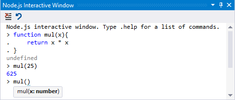
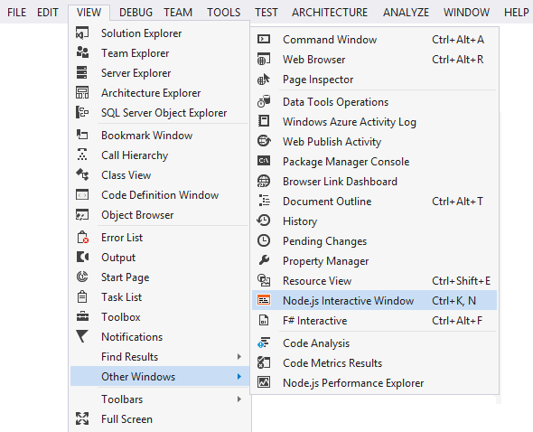
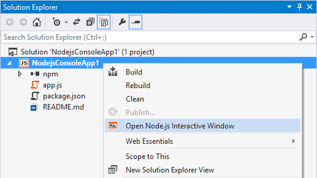
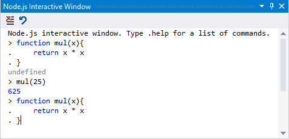
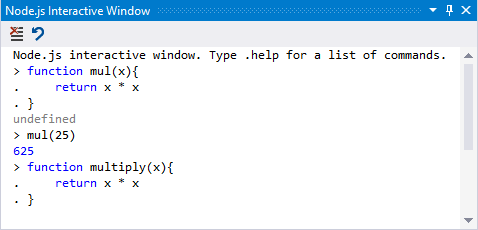
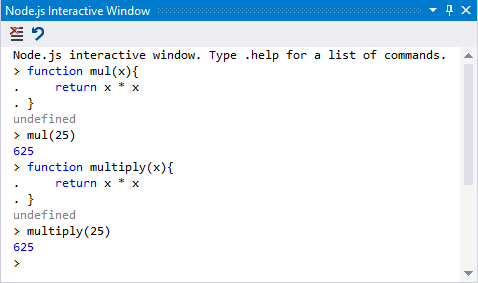
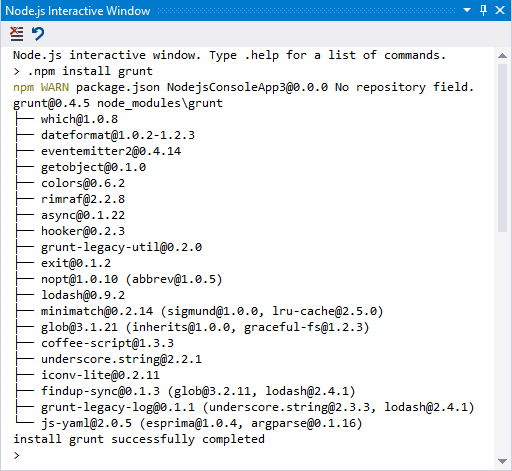

Working with the Interactive Window
===================================

Node.js Tools for Visual Studio includes an interactive window for your installed Node.js interpreter. Also known as a REPL (Read/Evaluate/Print Loop) window, this allows you to enter Node.js code and see the results immediately. You can use all built-in modules, syntax and variables, just like in a Node.js script.

Opening the Interactive Window
------------------------------
The easiest way is to type <kbd>CTRL</kbd> + <kbd>K</kbd>, followed by <kbd>N</kbd>.

That's the shortcut assigned to the command for View/Other Windows/Node.js Interactive Window:

Alternatively you can right-click on the project node and select the Interactive Window:

Editing
-------
You can use the up/down arrow keys to recall previous commands.

You can also navigate in the code to change a function.

And then re-execute:

Commands
--------

The interactive window has several built-in commands, which start with the dot prefix.

### .help

Shows a list of REPL commands.

### .clear

Resets the context object to an empty object and clears any multi-line expression.

### .cls

Clears the contents of the REPL editor window.

### .echo

Suppress or unsuppress output to the buffer.

Use `echo on` to enable, `echo off` to disable and `echo` without parameters to display the current state. Use `echo <text>` to echo the text passed in.

### .npm

Executes npm command. If solution contains multiple projects, specify target project using `.npm [ProjectName] <npm arguments>`

This is covered in more detail in the [wiki:"npm section of the documentation" Npm].

### .reset

Reset to an empty execution engine, but keep REPL history.

### .save

Save the current REPL session to a file.

### .wait

Wait for at least the specified number of milliseconds.

Known Issues
------------

- There is no way to abort a command that is currently executing.
- `require()` does not work against custom modules.
