TypeScript
==========

NTVS supports writing your Node.js applications using [TypeScript](http://www.typescriptlang.org/).

## TypeScript Installation

* Visual Studio 2013: TypeScript is included as part of [Visual Studio 2013 Update 2](http://www.microsoft.com/en-us/download/details.aspx?id=42666) or later.

* Visual Studio 2012: TypeScript is a separate download: [TypeScript 1.0 Tools for Visual Studio 2012](http://go.microsoft.com/fwlink/?LinkID=266563).

Note that you should install TypeScript before installing NTVS.  If you don't see the project templates for TypeScript/Node.js, and you have installed TypeScript after NTVS, you should uninstall and reinstall NTVS.

## Using TypeScript

This section shows many NTVS features in the context of a TypeScript project.  See the respective feature documentation for more details.

You will find the TypeScript templates under Templates\TypeScript\Node.js:

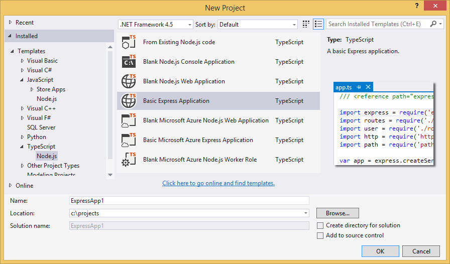

Every TypeScript project includes .d.ts files for node and for the packages used by the project template.

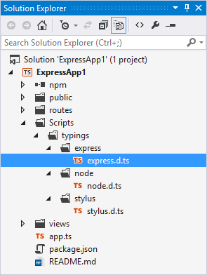

This will give you a great IntelliSense experience, even inside of callbacks:

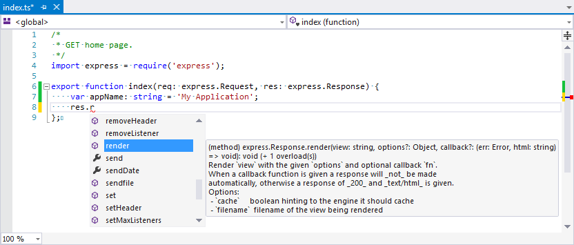

NTVS has item templates to add new TypeScript files, including templates for unit tests:

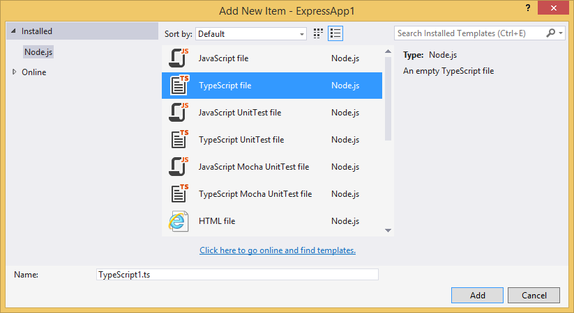

For .ts and .d.ts files to be compiled, the Build Action property must be set to `TypeScriptCompile`. This is done automatically when a .ts file is added to the project.

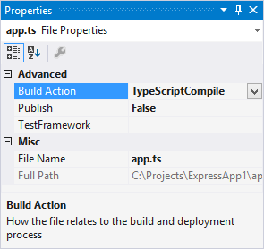

When you build, the TypeScript compiler is invoked:

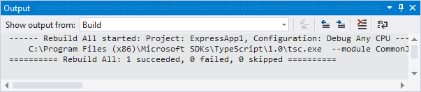

The TypeScript compiler generates .js and .js.map files for every .ts file in the project (but not .d.ts files).

Note that the startup file (bolded) is the .js file, despite the .js file not being included in the project. You can see the build output files and other non-project items when Show All Files is enabled (the 3rd button from the right in the screenshot below).

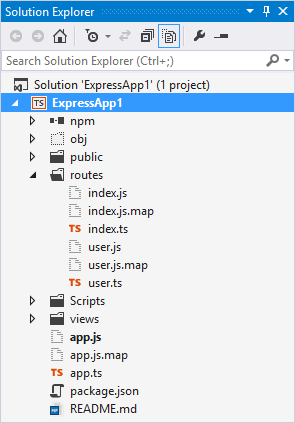

The debugger is TypeScript aware, so all debugging can take place in the TypeScript files. You can put breakpoints, get watch tooltips, etc.

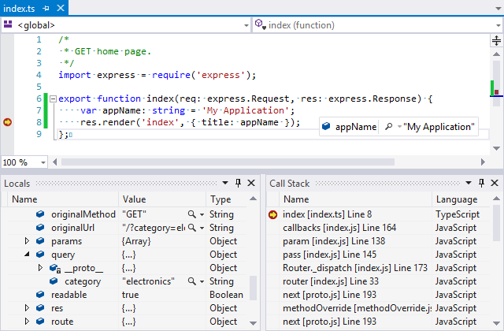

Test Explorer detects unit tests written in TypeScript.  Click on Run Test or Debug Test to run the test under the debugger:

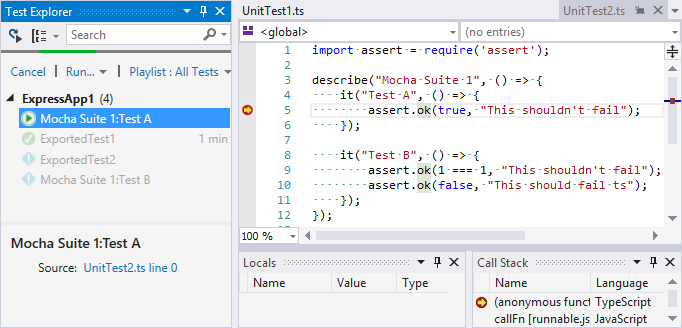

Profiling also works with TypeScript.  The profiling report will browse to the TypeScript file when you click on View Source.

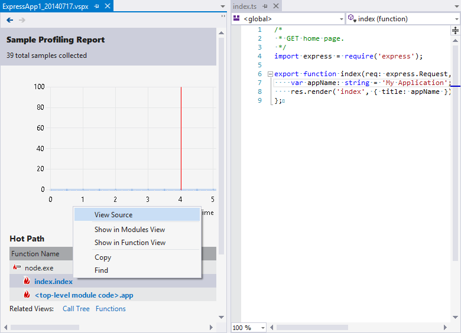

## Using TypeScript in a JavaScript project

If you've created a project using one of the JavaScript project templates, it won't have TypeScript build support or any of the TypeScript d.ts files.

When you add a TypeScript file to the project (using Add New Item, Add Existing Item or Include in Project), it will be updated to support TypeScript.

However, this won't add the node.d.ts file to the project.  You can add the node.d.ts file to your project manually by copying it from the NTVS install folder or from a project created using a TypeScript template.  For a VS 2013 Ultimate installation, the node.d.ts file is installed in:

`C:\Program Files (x86)\Microsoft Visual Studio 12.0\Common7\IDE\Extensions\Microsoft\Node.js Tools for Visual Studio\1.0\Scripts\Typings\Node\`

## Adding TypeScript Type Definitions

The Type Definitions (.d.ts files) that are distributed with NTVS and included in TypeScript projects come from [http://definitelytyped.org/](http://definitelytyped.org/).

You can get additional .d.ts files from their [github repository](https://github.com/borisyankov/DefinitelyTyped) or using [TypeScript Definition manager (TSD)](http://definitelytyped.org/tsd/).

### TypeScript Definition manager (TSD)

TSD is a command line utility that downloads .d.ts files from the DefinitelyTyped repository.  It is typically installed globally, and is located in your PATH so it can be used from anywhere.

TSD requires Git to be available in your PATH.  You can download Git for Windows from [http://msysgit.github.io/](http://msysgit.github.io/).

#### Option A: Install TSD using the Node.js Interactive Window:

1. Open the Node.js Interactive Window with <kbd>Ctrl</kbd> + <kbd>K</kbd>, <kbd>N</kbd>.

1. Type `.npm install tsd -g`

  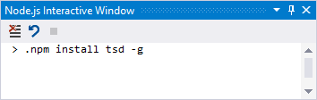

#### Option B: Install TSD using the npm UI:

1. Click on the npm node in Solution Explorer and select Install New npm Packages.

  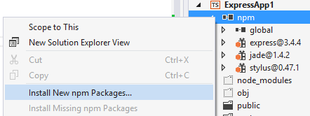

1. In the search box, type `tsd`.

1. Select the Global dependency type.

1. Uncheck Add to package.json.

1. Click Install Package.

  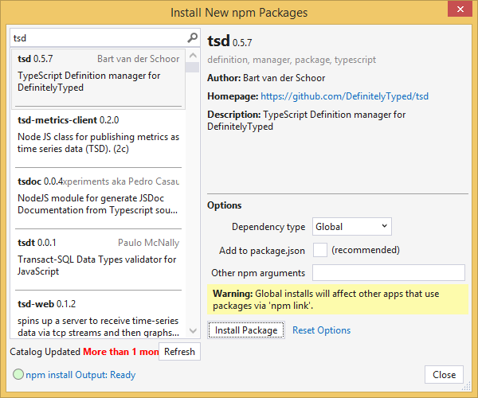

### Adding Type Definitions to the project with TSD

1. Now that you have TSD installed globally, open a Command Prompt in your project folder.

  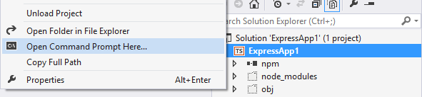

1. Install the .d.ts that you require, for example mocha.d.ts:

  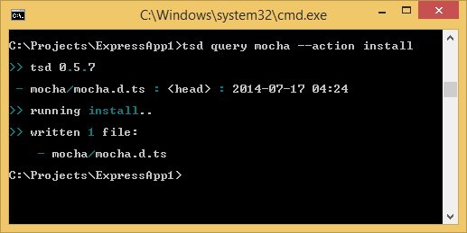

1. Right-click the .d.ts file and select Include in Project.

  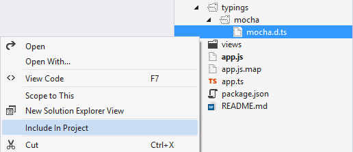
