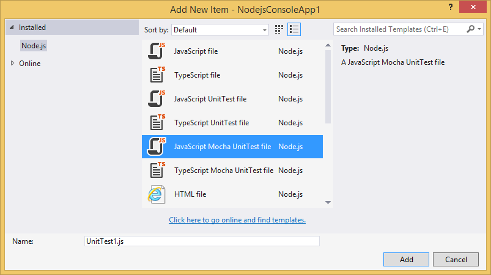
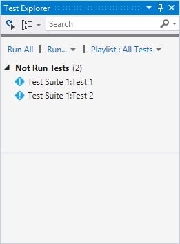
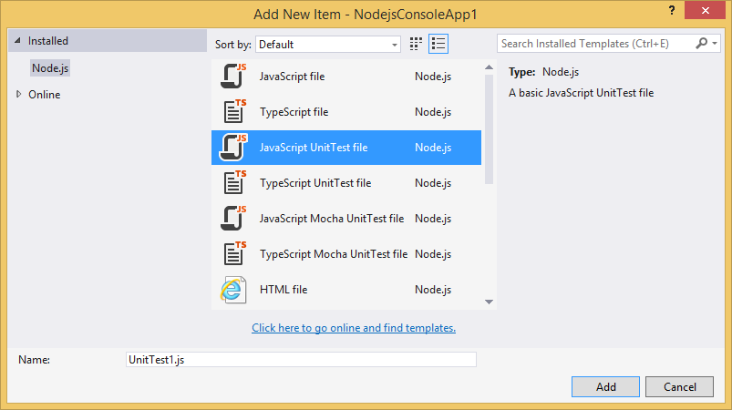
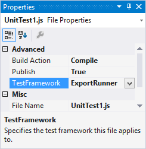
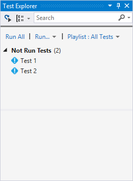
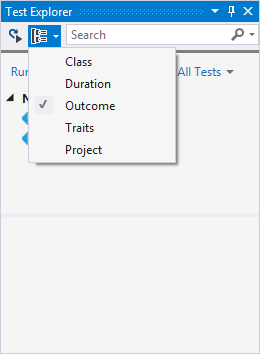
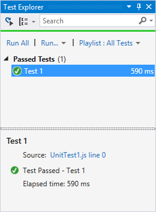
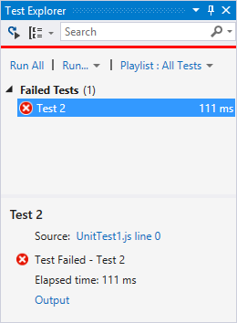
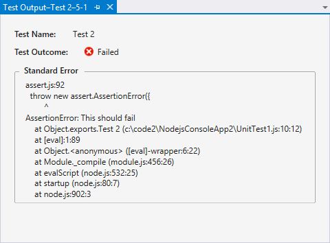

Unit Tests
==========

Unit tests are short sections of code that test small pieces of functionality belonging to a larger program. By demonstrating that each piece of a program is correct, it is easier to infer that the entire program is correct.

Node.js uses unit tests extensively to validate scenarios while designing a program. Node.js Tools for Visual Studio includes support for discovering and executing unit tests. This allows you to author your tests and run them without having to switch to a command prompt.

Discovering Tests
=================

### Discovering Mocha Tests

To ensure your mocha test(s) can be found and run, follow these rules:

* Install mocha locally. NTVS will **not** use a global mocha installation.

* Set the Test Framework property for the JavaScript or TypeScript file to "Mocha".

* Define your test functions using `describe` and `it`.

Blank tests that follow these rules can be added by selecting Project, Add New Item (<kbd>CTRL</kbd>+<kbd>SHIFT</kbd>+<kbd>A</kbd>) and choosing "JavaScript Mocha UnitTest file".



This will add a new file containing a mocha unit test.

```javascript
var assert = require('assert');

describe('Test Suite 1', function() {
    it('Test 1', function() {
        assert.ok(true, "This shouldn't fail");
    })

    it('Test 2', function() {
        assert.ok(1 === 1, "This shouldn't fail");
        assert.ok(false, "This should fail");
    })
})
```

The Test Framework property is automatically set to "Mocha".


Hit Build (<kbd>CTRL</kbd>+<kbd>SHIFT</kbd>+<kbd>B</kbd>), and the tests will be discovered and displayed in the Test Explorer. (If you do not see the Test Explorer window, click the Test menu, then Windows and Test Explorer.)



### Discovering Exported Tests

To ensure your exported test(s) can be found and run, follow these rules:

* Set the Test Framework property for the JavaScript or TypeScript file to "ExportRunner".

* Export your test functions

Blank tests that follow these rules can be added by selecting Project, Add New Item (<kbd>CTRL</kbd>+<kbd>SHIFT</kbd>+<kbd>A</kbd>) and choosing "JavaScript UnitTest file".



This will add a new file containing a basic unit test.

```javascript
var assert = require('assert');

exports['Test 1'] = function (test) {
    assert.ok(true, "This shouldn't fail");
}

exports['Test 2'] = function (test) {
    assert.ok(1 === 1, "This shouldn't fail");
    assert.ok(false, "This should fail");
}
```

The Test Framework property is automatically set to "ExportRunner".




Hit Build (<kbd>CTRL</kbd>+<kbd>SHIFT</kbd>+<kbd>B</kbd>), and the tests will be discovered and displayed in the Test Explorer. (If you do not see the Test Explorer window, click the Test menu, then Windows and Test Explorer.)



### Test Explorer Groups/Filters

As you add more tests to your project, you may prefer to group or filter the tests that are displayed. The "Group By" menu on the toolbar will allow you to collect your tests into different groups, and the search toolbox will filter by matching names. Double-clicking a test will open the source file containing the test implementation.



Running Tests
=============

Tests can be run by clicking "Run All" in the Test Explorer window, or by selecting one or more tests or groups, right-clicking and selecting "Run Selected Tests". Tests will be run in the background and the display will be updated to show the results.

Tests that pass are shown with a green tick. The amount of time taken to run the test is also displayed.



Tests that fail are shown with a red cross.



 The "Output" link can be clicked to display the text that was printed to the console during the test, including the standard unittest output.



Test Framework Extensibility
============================

NTVS can be extended to support additional test frameworks by implementing the discovery and execution logic using JavaScript.

In the following location:
`<VisualStudioFolder>\Common7\IDE\Extensions\Microsoft\Node.js Tools for Visual Studio\1.0\TestFrameworks`

You'll see folders for ExportRunner and Mocha.

Under each folder, a JavaScript file named after the folder contains 2 exported functions:

* `find_tests`
* `run_tests`

See the implementation of ExportRunner and Mocha for examples of `find_tests` and `run_tests` implementations.

In your NTVS project, make sure to set the TestFramework property on your test file(s) to match the name of the subfolder under TestFrameworks.

If you implement support for other test frameworks and wish to contribute them, please let us know!
